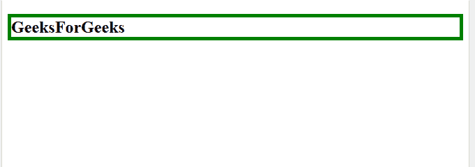

# jQuery |【属性=值】选择器

> 原文:[https://www . geesforgeks . org/jquery-attribute value-selector/](https://www.geeksforgeeks.org/jquery-attributevalue-selector/)

jQuery **【属性=值】**选择器用于选择和修改具有指定属性和值的 HTML 元素。

**参数值:**

*   **属性:**用于指定要查找的属性。
*   **值:**用于指定要查找的值。

**语法:**

```html
$("[attribute=value]")

```

**示例-1:** 本示例选择 id 为 GFG 的元素，并为其添加边框。

```html
<!DOCTYPE html>
<html>

<head>

    <script src=
"https://ajax.googleapis.com/ajax/libs/jquery/3.3.1/jquery.min.js">
  </script>

    <script>
        $(document).ready(function() {
            $("[id=GFG]").css(
              "border", "5px solid green");
        });
    </script>

</head>

<body>

    <h2 id="GFG">
      GeeksForGeeks
  </h2>

</body>

</html>
```

**输出:**


**示例-2:** 本示例更改具有值为 GFG 的类属性的元素的文本颜色。

```html
<!DOCTYPE html>

<html>

<head>

    <script src=
"https://ajax.googleapis.com/ajax/libs/jquery/3.3.1/jquery.min.js">
  </script>

    <script>
        $(document).ready(function() {
            $("[class=GFG]").css(
              "color", "green");
        });
    </script>

</head>

<body>

    <h2 class="GFG">
      GeeksForGeeks
  </h2>

</body>

</html>
```

**输出:**
