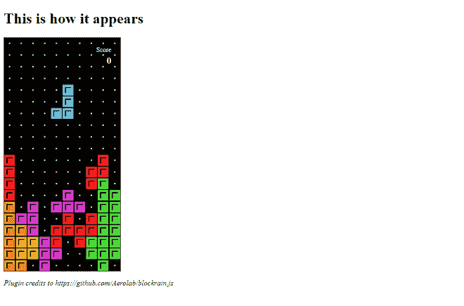

# jquery block ain . js plugin

> 哎哎哎::1230【https://www . geeksforgeeks . org/jquery-block ain-js 插件/

jQuery 插件使用通常需要很长时间才能正确编程的特性来增强应用程序。然而，一些插件在为用户提供娱乐方面很有用。虽然许多专业网站可能不需要这些，但将其包含在个人博客和网站中是一个有趣的功能。

**Blockrain.js** 插件提供一个用 HTML5 和 JavaScript 创建的俄罗斯方块游戏。**俄罗斯方块**是一款著名的游戏，也是人们玩过和用过的著名游戏之一。将此插件添加到您的网站将使用户更加关注您的内容。

**Blockrain.js** 不仅可以帮你嵌入游戏，还可以自定义某些元素，比如

*   您可以更改主题以适合网站的配色方案。
*   你可以调整正在下落的积木的速度，也可以随着名字的变化而变化。
*   您可以选择添加记分板。
*   它有一个自动播放功能，你可以添加。

该插件在其网站上以相同的名称提供，它还有一个专门用于文档的 Github 存储库。

***注意:*** 在使用之前，先下载文件或者 zip 文件，存储起来在你的项目中实现。

**从链接下载文件:**

```html
https://github.com/Aerolab/blockrain.js
```

#### HTML:

下面的代码演示了使用 HTML 标签来显示最低要求的基本页面结构。

## 超文本标记语言

```html
<!DOCTYPE html>
<html>

<body>
    <h1>This is how it appears</h1>

    <!-- The div tag below is given 
        by the plugin developer -->
    <div class="game" style=
        "width:250px; height:500px;">
    </div>

    <p><em>
        Plugin credits to 
        https://github.com/Aerolab/blockrain.js
    </em></p>  
</body>

</html>
```

**注意:**对于 CSS 部分，样式表是链接的，由插件提供。

**jQuery code:**

## java 描述语言

```html
  <script>
    $game = $('.game').blockrain();
</script>
```

这涉及到基本的 jQuery 语法，包括选择器和操作。

*   $定义使用 jQuery。
*   。*游戏*是 HTML 的类。

**最终代码:**

## 超文本标记语言

```html
<!DOCTYPE html>
<html>

<head>

    <link rel="stylesheet" href="blockrain.css">
    <script src=
"https://code.jquery.com/jquery-2.1.4.min.js">
    </script>
    <script src="blockrain.jquery.min.js"></script>
</head>

<body>
    <h1>This is how it appears</h1>

    <div class="game" style=
        "width:250px; height:500px;">
    </div>

    <p><em>
        Plugin credits to 
        https://github.com/Aerolab/blockrain.js
    </em></p>

    <script>
        $game = $('.game').blockrain();
    </script>
</body>

</html>
```

**输出:**


**主题:**我们可以通过添加主题或他们提供的任何内容来定制。让我们看看这个的示例代码。

已经提供的选项有:

*   现代的
*   重新流行
*   糖果
*   精力
*   游戏男孩

还提供了更多。

让我们将主题改为其中之一。您所需要做的就是向已经存在的代码中添加一条语句:

## 超文本标记语言

```html
<!DOCTYPE html>
<html>

<head>
    <link rel="stylesheet" href="blockrain.css">
    <script src=
"https://code.jquery.com/jquery-2.1.4.min.js">
    </script>
    <script src="blockrain.jquery.min.js">
    </script>
</head>

<body>
    <h1>This is how it appears</h1>

    <div class="game" style=
        "width:250px; height:500px;">
    </div>

    <p><em>
        Plugin credits to 
        https://github.com/Aerolab/blockrain.js
    </em></p>

    <script>
        $game = $('.game').blockrain();

        /* This is where you add the line 
        to change the theme */

        $game.blockrain('theme', 'retro');
    </script>
</body>

</html>
```

**输出:**


游戏男孩主题



复古主题

它是高度可定制的，对于喜欢添加一些有趣元素的网站来说，这将是它的完美插件。