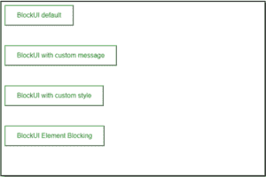
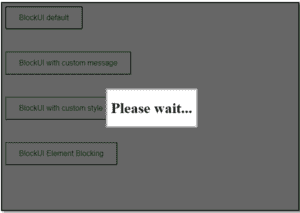
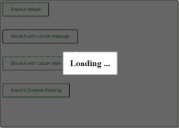
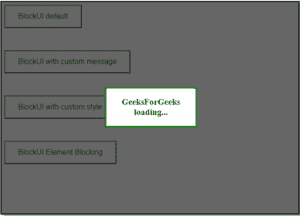
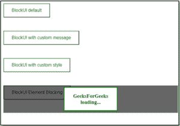

# jQuery BlockUI 插件

> 哎哎哎::1230【https://www . geeksforgeeks . org/jquery-block ui 插件/

**块界面插件**用于模拟同步 AJAX 行为。激活后，它会阻止用户与页面交互，直到页面被停用。DOM(文档对象模型)添加了一些元素，以提供良好的用户界面外观和感觉以及行为。

**下载链接:**

```html
<script src="https://malsup.github.io/jquery.blockUI.js"></script>

```

**语法:**用于阻止用户界面

```html
$.blockUI(); 

```

用于解锁用户界面

```html
$.unblockUI(); 

```

当我们在没有参数的情况下调用**块界面**时，它会在屏幕上显示一条“请等待”的信息。我们可以通过添加参数来改变消息。要只阻止一个元素而不阻止整个页面，我们必须进行一个稍微不同的调用，**阻止**和**取消阻止**。为了更好地理解，让我们看一个基本的例子。

**示例:**

```html
<!DOCTYPE html>
<html>

<head>
    <title>BlockUI</title>

    <script src=
"https://cdnjs.cloudflare.com/ajax/libs/jquery/3.3.1/jquery.min.js">
    </script>

    <script src=
        "https://malsup.github.io/jquery.blockUI.js">
    </script>

    <style>
        .btn {
            background-color: white;
            color: black;
            padding: 14px 28px;
            font-size: 16px;
            cursor: pointer;
            margin-bottom: 3rem;
        }

        .success {
            border-color: #4CAF50;
            color: green;
        }

        .success:hover {
            background-color: #4CAF50;
            color: white;
        }
    </style>
</head>

<body>
    <button class="btn success" id="blockd">
        BlockUI default</button>
    <br>
    <button class="btn success" id="blockm">
        BlockUI with custom message</button>
    <br>
    <button class="btn success" id="blocks">
        BlockUI with custom style
    </button>
    <div id="blockel">
        <button class="btn success" id="blocke">
            BlockUI Element Blocking</button>
    </div>
    <div id="message" style="display: none;">
        <h1>Loading ...</h1>
    </div>

    <script>
        $(document).ready(function () {
            $("#blockd").click(function () {

                // Default blockUI code
                $.blockUI();
                setTimeout(function () {

                    // Timer to unblock    
                    $.unblockUI();
                }, 3000);
            });

            $("#blockm").click(function () {

                // blockUI code with custom message
                $.blockUI({ message: $('#message') });
                setTimeout(function () {
                    $.unblockUI();
                }, 3000);
            });

            $("#blocks").click(function () {
                $.blockUI({

                    // blockUI code with custom 
                    // message and styling
                    message: "<h3>GeeksForGeeks loading...<h3>",
                    css: { color: 'green', borderColor: 'green' }
                });
                setTimeout(function () {
                    $.unblockUI();
                }, 3000);
            });

            $("#blocke").click(function () {
                $("#blockel").block({

                    // BlockUI code for element blocking
                    message: "<h3>GeeksForGeeks loading...<h3>",
                    css: { color: 'green', borderColor: 'green' }
                });
                setTimeout(function () {
                    $("#blockel").unblock();
                }, 3000);
            });
        });
    </script>
</body>

</html>
```

**输出:**

**在区块界面激活前:**


**区块界面激活后:**

**默认区块界面:**


**带自定义消息的区块界面:**


**带自定义造型的块状 ui:**


**块状元素阻挡:**
