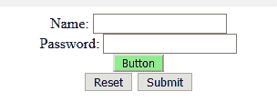
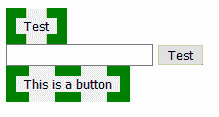

# jQuery |:按钮选择器

> 原文:[https://www.geeksforgeeks.org/jquery-button-selector/](https://www.geeksforgeeks.org/jquery-button-selector/)

**jQuery:按钮选择器**通过**选择按钮元素和输入元素。如果我们使用 ***输入=“按钮”**作为选择器*，则不选择按钮元素。**

**语法:**

```html
$(":button")
```

**示例-1:**

```html
<!DOCTYPE html>
<html>

<head>
    <script src=
"https://ajax.googleapis.com/ajax/libs/jquery/3.3.1/jquery.min.js">
  </script>

  <script>
        $(document).ready(function() {
            $(":button").css(
              "background-color", "lightgreen");
        });
    </script>
</head>

<body>

    <center>
        <form action="">
            Name:
            <input type="text" 
                   name="user">
            <br> Password:
            <input type="password" 
                   name="password">
            <br>
            <button type="button">
              Button
          </button>
            <br>
            <input type="reset" 
                   value="Reset">
            <input type="submit"
                   value="Submit">
            <br>
        </form>
    </center>

</body>

</html>
```

**输出:**


**示例-2:**

```html
<!DOCTYPE html>
<html>

<head>
    <script src=
"https://ajax.googleapis.com/ajax/libs/jquery/2.1.4/jquery.min.js">
  </script>

</head>

<body>
    <input type="button" 
           value="Test" />
    <br>
    <input id="txtName" 
           type="text" />
    <input type="submit" 
           value="Test" />
    <br>

    <button id="button1">
      This is a button
  </button>
    <br>

    <script>
        $(function() {
            $(":button").css(
            "border", "10px dashed green");
        });
    </script>
</body>

</html>
```

**输出:**
