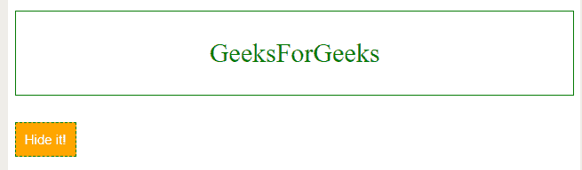
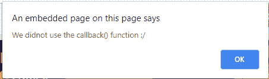
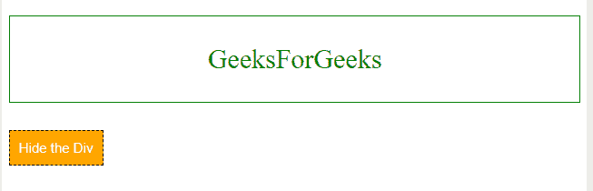
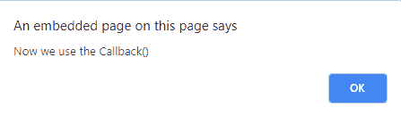
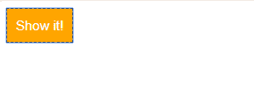

# jQuery |回调函数

> 原文:[https://www.geeksforgeeks.org/jquery-callback-functions/](https://www.geeksforgeeks.org/jquery-callback-functions/)

JavaScript 语句总是一行一行地执行。但是，由于 JQuery 效果需要一些时间来完成，所以在前面的效果还在执行的时候，下面的代码行可能会被执行。这必然会造成效果和动画的错误和重叠。
为了防止这种情况发生，JQuery 为每个效果提供了一个**回调**函数。
一旦效果完成，将执行**回调()功能**。它总是作为方法的最后一个参数写入。

**语法:**

```
 $(selector).effect_function(speed, callback);
```

**方法:**
我们将不使用回调函数并尝试切换 **div** 元素的代码。同时，我们将使用一个警报(Javascript 浏览器警报)来展示回调()对我们有多有用。

**示例-1:** 我们定义一个 div，并在 div 下面添加一个按钮。现在，我们使用一个简单的 JQuery 代码使按钮允许 div 隐藏。

```
<!DOCTYPE html>
<html lang="en">

<head>
    <title>Callback function
  </title>
    <script src=
"https://code.jquery.com/jquery-1.12.4.min.js">
  </script>
    <style type="text/css">
        p {
            background: white;
            border: 1px green solid;
            font-size: 30px;
            padding: 30px;
            text-align: center;
            color: green;
        }

        button {
            background: orange;
            border: 1px black dashed;
            font-size: 15px;
            padding: 10px;
            text-align: center;
            color: white;
            cursor: pointer
        }
    </style>
    <script type="text/javascript">
        $(document).ready(function() {
            $("button").click(function() {
              // toggle the div, using slideToggle effect.
                $("p").slideToggle("fast"); 

              //alert outside callback
            alert("We didnot use the callback() function :"); 
                $('#b').text("Show it!");
            });
        });
    </script>
</head>

<body>
    <p>GeeksForGeeks</p>
    <button id="b"
            type="button">
      Hide it!
  </button>
</body>

</html>
```

**输出:**

**点击前:**


**点击后提醒:**


**点击后:**


**示例-2:** 现在我们在**中添加回调函数 slideToggle()**
查看代码和区别:

```
<!DOCTYPE html>
<html lang="en">

<head>
    <title>Callback function
  </title>

    <script src=
"https://code.jquery.com/jquery-1.12.4.min.js">
  </script>

    <style type="text/css">
        p {
            background: white;
            border: 1px green solid;
            font-size: 30px;
            padding: 30px;
            text-align: center;
            color: green;
        }

        button {
            background: orange;
            border: 1px black dashed;
            font-size: 15px;
            padding: 10px;
            text-align: center;
            color: white;
            cursor: pointer
        }
    </style>
    <script type="text/javascript">
        $(document).ready(function() {
            $("button").click(function() {
                $("p").slideToggle("fast",
                       function callback() {
                    $('#b').text("Show it!");

               // alert define inside the callback
                alert("Now we use the Callback()"); 

                });
            });
        });
    </script>
</head>

<body>
    <p>GeeksForGeeks</p>
    <button id="b" type="button">Hide the Div</button>
</body>

</html>
```

**输出:**

**点击前:**


**点击后提醒:**


**点击后:**
