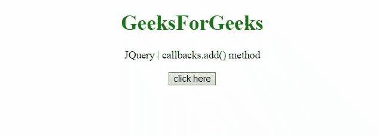

# jQuery 回调. add()方法

> 原文:[https://www.geeksforgeeks.org/jquery-callbacks-add-method/](https://www.geeksforgeeks.org/jquery-callbacks-add-method/)

jQuery **回调. add()** 方法用于向回调列表添加回调或回调集合。此方法返回它所附加到的回调对象(这)。

**语法:**

```html
callbacks.add(callbacks)

```

**参数:**

*   **回调:**这个参数保存一个函数，或者函数数组，这些函数将被添加到回调列表中。

**例 1:** 这个方法在回调中添加一个方法 **fun1()** 并调用它。

```html
<!DOCTYPE HTML>
<html>

<head>
    <title>
        jQuery callbacks.add() method
    </title>

    <script src=
"https://code.jquery.com/jquery-3.5.0.js">
    </script>
</head>

<body style="text-align:center;">
    <h1 style="color:green;">
        GeeksForGeeks
    </h1>

    <p id="GFG_UP"></p>

    <button onclick="Geeks();">
        click here
    </button>

    <p id="GFG_DOWN"></p>

    <script>
        var el_up = document.getElementById("GFG_UP");
        var el_down = document.getElementById("GFG_DOWN");
        el_up.innerHTML = 
                    "JQuery | callbacks.add() method";
        var res = "";

        function Geeks() {

            // First function to be added to the list
            var fun1 = function (val) {
                res = res + "This is function 1 and"
                + " value passed is " + val + "<br>";
            };
            var callbacks = jQuery.Callbacks();
            callbacks.add(fun1); //Aadding the func1
            callbacks.fire("GFG_1"); // Calling the fun1
            el_down.innerHTML = res;
        } 
    </script>
</body>

</html>
```

**输出:**


**示例 2:** 本示例将方法 **fun1()** 和 **fun2()** 添加到回调中，然后调用它们。请注意，第二次调用 **fire()** 方法时，它使用相同的参数“GFG_2”调用这两个函数。

```html
<!DOCTYPE HTML>
<html>

<head>
    <title>
        jQuery callbacks.add() method
    </title>

    <script src=
"https://code.jquery.com/jquery-3.5.0.js">
    </script>
</head>

<body style="text-align:center;">
    <h1 style="color:green;">
        GeeksForGeeks
    </h1>

    <p id="GFG_UP"></p>

    <button onclick="Geeks();">
        click here
    </button>

    <p id="GFG_DOWN"></p>

    <script>
        var el_up = document.getElementById("GFG_UP");
        var el_down = document.getElementById("GFG_DOWN");
        el_up.innerHTML = 
                "JQuery | callbacks.add() method";
        var res = "";

        function Geeks() {

            // First function to be added to the list
            var fun1 = function (val) {
                res = res + "This is function 1 and"
                + " value passed is " + val + "<br>";
            };

            // Second function to  be added to the list
            var fun2 = function (val) {
                res = res + "This is function 2 and "
                    + "value passed is" + val + "<br>";
            };

            var callbacks = jQuery.Callbacks();

            // Adding the function 1
            callbacks.add(fun1);

            // Calling the function 1
            callbacks.fire("GFG_1");

            // Adding the function 2
            callbacks.add(fun2); 

            // Calling the function 2
            callbacks.fire("GFG_2"); 

            // res of the both functions
            el_down.innerHTML = res; 
        } 
    </script>
</body>

</html
```

**输出:**
