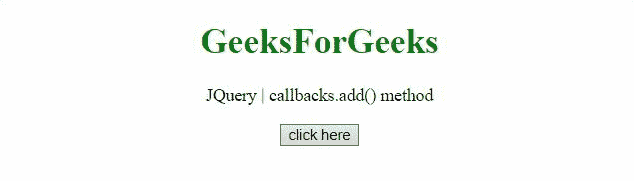

# JQuery 回调. disable()方法

> 原文:[https://www . geesforgeks . org/jquery-回调-禁用-方法/](https://www.geeksforgeeks.org/jquery-callbacks-disable-method/)

JQuery 中的**回调. disable()方法**用于禁止回调列表进一步执行任何其他操作。这个方法返回它所附着的回调对象(这个)
**语法:**

```html
callbacks.disable()
```

下面讨论两个例子:

*   **示例:**本示例在添加和触发函数后禁用回调。

    ```html
    <!DOCTYPE HTML> 
    <html>  
    <head> 
        <title> 
          JQuery | callbacks.disable() method
        </title>
        <script src=
    "https://code.jquery.com/jquery-3.5.0.js"></script> 
    </head>   
    <body style="text-align:center;">
        <h1 style="color:green;">  
            GeeksForGeeks  
        </h1> 
        <p id="GFG_UP"> 
        </p>
        <button onclick = "Geeks();">
        click here
        </button>
        <p id="GFG_DOWN"> 
        </p>       
        <script> 
            var el_up = document.getElementById("GFG_UP");
            var el_down = document.getElementById("GFG_DOWN");
            el_up.innerHTML = "JQuery | callbacks.disable() method";
            var res = "";
            function Geeks() {
                // first function to be added to the list
                var fun1 = function(val) {
                  res = res + 
    "This is function 1 and value passed is " + val + "<br>";
                };  
                // second function to  be added to the list
                var fun2 = function(val) {
                  res = res + 
    "This is function 2 and value passed is" + val + "<br>";
                };
                var callbacks = jQuery.Callbacks();
                callbacks.add(fun1); // adding the function 1
                callbacks.fire("GFG_1"); // calling the function 1
                callbacks.disable(); /*disables further calls 
                                       to a callback list*/
                callbacks.add(fun2); // This will not work.
                callbacks.fire("GFG_2"); // This will not work.
                el_down.innerHTML = res;
            } 
        </script> 
    </body>   
    </html>     
    ```

*   **输出:**
    

*   **示例:**这个示例提供了一个按钮，首先禁用回调，然后添加并激发方法来查看结果。

    ```html
    <!DOCTYPE HTML> 
    <html>  
    <head> 
        <title> 
          JQuery | callbacks.disable() method
        </title>
        <script src=
    "https://code.jquery.com/jquery-3.5.0.js"></script> 
    </head>   
    <body style="text-align:center;">
        <h1 style="color:green;">  
            GeeksForGeeks  
        </h1> 
        <p id="GFG_UP"> 
        </p>
        <button onclick = "Geeks();">
        click here
        </button>
        <button onclick = "disable();">
        disable
        </button>
        <p id="GFG_DOWN"> 
        </p>       
        <script> 
            var el_up = document.getElementById("GFG_UP");
            var el_down = document.getElementById("GFG_DOWN");
            el_up.innerHTML = "JQuery | callbacks.disable() method";
            var res = "";
            var callbacks = jQuery.Callbacks();
            function disable() {
                callbacks.disable();
            }
            function Geeks() {
                // first function to be added to the list
                var fun1 = function(val) {
                  res = res + 
    "This is function 1 and value passed is " + val + "<br>";
                };  
                // second function to  be added to the list
                var fun2 = function(val) {
                  res = res + 
    "This is function 2 and value passed is" + val + "<br>";
                };
                callbacks.add(fun1); // adding the function 1
                callbacks.fire("GFG_1"); // calling the function 1
                callbacks.add(fun2); // This will not work.
                callbacks.fire("GFG_2"); // This will not work.
                el_down.innerHTML = res;
            } 
        </script> 
    </body>   
    </html>     

    ```

*   **输出:**
    