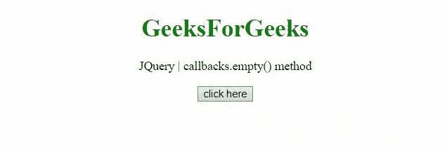
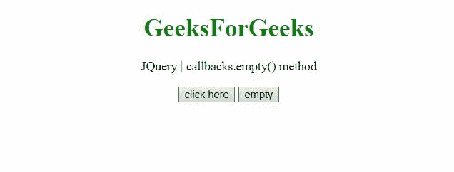

# jQuery 回调. empty()方法

> 原文:[https://www . geesforgeks . org/jquery-回调-空-方法/](https://www.geeksforgeeks.org/jquery-callbacks-empty-method/)

jQuery 中的**回调. empty()方法**用于从列表中移除所有回调。它返回它所附加到的回调对象。

**语法:**

```html
callbacks.empty()
```

**参数:**不接受任何参数。

**返回值:**这个方法返回它所附着的回调对象。

下面的例子说明了 jQuery 中的**回调. empty()方法**:

**示例 1:** 在本例中， *fun1* 函数首先被添加到回调列表中，所有存在的回调都在列表中用给定的参数执行。执行**回调. empty()** 方法清空列表。添加第二个功能 *fun2* ，再次执行回调列表。这演示了在添加第一个函数后清空列表。

## 超文本标记语言

```html
<!DOCTYPE HTML>
<html>

<head>
    <title>
        JQuery callbacks.empty() method
    </title>

    <script src=
"https://code.jquery.com/jquery-3.5.0.js">
    </script>
</head>

<body style="text-align:center;">

    <h1 style="color:green;">
        GeeksForGeeks
    </h1>

    <p>
        JQuery | callbacks.empty() method
    </p>

    <button onclick="Geeks();">
        click here
    </button>

    <p id="output"></p>

    <script>
        var output = document.getElementById("output");
        var res = "";

        // Initialize a callback list
        var callbacks = jQuery.Callbacks();

        function Geeks() {

            // First function to be added to the list
            var fun1 = function (val) {
                res = res + "This is function 1 and" +
                    " value passed is " + val + "<br>";
            };

            // Second function to be added to the list
            var fun2 = function (val) {
                res = res + "This is function 2 and" +
                    " value passed is " + val + "<br>";
            };

            // Adding the first function
            callbacks.add(fun1);

            // Calling the first function
            callbacks.fire("GFG_1");

            // Clearing the callback list
            callbacks.empty();

            // Adding the second function
            callbacks.add(fun2);

            // Calling the first function
            callbacks.fire("GFG_2");

            output.innerHTML = res;
        } 
    </script>
</body>

</html>
```

**输出:**



**示例 2:** 这个示例提供了一个按钮来清空回调列表，然后添加给定的函数来查看清空回调列表的结果。

## 超文本标记语言

```html
<!DOCTYPE HTML>
<html>

<head>
    <title>
        JQuery | callbacks.empty() method
    </title>

    <script src=
"https://code.jquery.com/jquery-3.5.1.min.js">
    </script>
</head>

<body style="text-align:center;">

    <h1 style="color:green;">
        GeeksForGeeks
    </h1>

    <p>
        JQuery | callbacks.empty() method
    </p>

    <button onclick="Geeks();">
        click here
    </button>

    <button onclick="empty();">
        empty
    </button>

    <p id="output"></p>

    <script>
        var output = document.getElementById("output");
        var res = "";

        // Initialize a callback list
        var callbacks = jQuery.Callbacks();

        function empty() {

            // Clear the callback list
            callbacks.empty();
        }

        // Function to add and fire callbacks 
        function Geeks() {

            // Function to be added to the list
            var fun1 = function (val) {
                res = res + "This is function 1 and" +
                    " value passed is " + val + "<br>";
            };

            // Adding the given function
            callbacks.add(fun1);

            // Calling the function with value
            callbacks.fire("GFG_1");

            output.innerHTML = res;
        } 
    </script>
</body>

</html>
```

**输出:**

