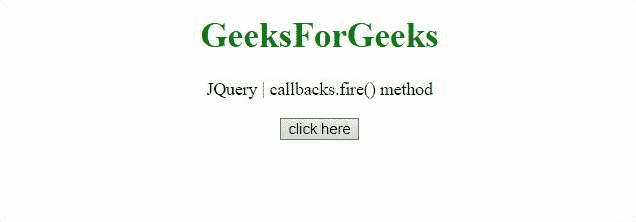
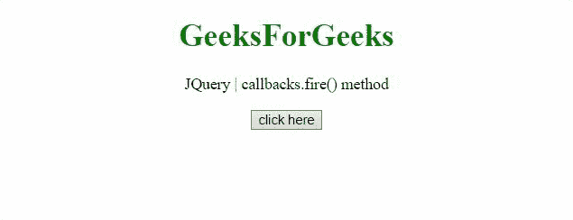

# jQuery 回调. fire()方法

> 原文:[https://www.geeksforgeeks.org/jquery-callbacks-fire-method/](https://www.geeksforgeeks.org/jquery-callbacks-fire-method/)

jQuery **回调. fire()** 方法用于调用列表中给定参数的所有回调。这个方法返回它被附加到的回调对象(这个)。

**语法:**

```
callbacks.fire( arguments )
```

**参数:**

*   **参数:**该参数定义了要传递回回调列表的参数或参数列表。

**返回值:**这个方法返回它所附着的回调对象(这个)。

**示例 1:** 本示例将 *fun1()* 添加到回调中，然后调用 **fire()** 方法，然后再次添加使用不同参数调用回调的相同方法。

```
<!DOCTYPE HTML>
<html>

<head>
    <title>
        jQuery callbacks.fire() method
    </title>

    <script src=
"https://code.jquery.com/jquery-3.5.0.js">
    </script>
</head>

<body style="text-align:center;">

    <h1 style="color:green;">
        GeeksForGeeks
    </h1>

    <p id="GFG_UP"></p>

    <button onclick="Geeks();">
        click here
    </button>

    <p id="GFG_DOWN"></p>

    <script>
        var el_up = document.getElementById("GFG_UP");
        var el_down = document.getElementById("GFG_DOWN");
        el_up.innerHTML = "JQuery | callbacks.fire() method";
        var result = "";
        var callbacks = jQuery.Callbacks();

        function Geeks() {

            // First function to be added to the list
            var fun1 = function (val) {
                result = result + "This is function 1 "
                    + "and value passed is " + val + "<br>";
            };

            // Adding the function 1
            callbacks.add(fun1);

            // Calling with 'GFG_1'
            callbacks.fire("GFG_1");

            // Adding the function 1 again
            callbacks.add(fun1); 

            // Calling with argument'GFG_2'
            callbacks.fire("GFG_2");
            el_down.innerHTML = result;
        } 
    </script>
</body>

</html>
```

**输出:**


**示例 2:** 本示例将两个不同的函数相加，并用不同的参数调用它们。

```
<!DOCTYPE HTML>
<html>

<head>
    <title>
        JQuery | callbacks.fire() method
    </title>

    <script src=
"https://code.jquery.com/jquery-3.5.0.js">
    </script>
</head>

<body style="text-align:center;">
    <h1 style="color:green;">
        GeeksForGeeks
    </h1>

    <p id="GFG_UP"></p>

    <button onclick="Geeks();">
        click here
    </button>

    <p id="GFG_DOWN"></p>

    <script>
        var el_up = document.getElementById("GFG_UP");
        var el_down = document.getElementById("GFG_DOWN");
        el_up.innerHTML = "JQuery | callbacks.fire() method";
        var result = "";
        var callbacks = jQuery.Callbacks();
        function Geeks() {
            // function to be added to the list
            var fun1 = function (val) {
                result = result + "This is function 1 and"
                    + " value passed is " + val + "<br>";
            };
            var fun2 = function (val) {
                result = result + "This is function 2 and"
                    + " value passed is " + val + "<br>";
            };
            callbacks.add(fun1); // Adding the function 1
            callbacks.fire("GFG_1"); // Calling with 'GFG_1'
            callbacks.add(fun2); // Adding the function 2
            callbacks.fire("GFG_2"); // Calling with 'GFG_2'
            el_down.innerHTML = result;
        } 
    </script>
</body>

</html> 
```

**输出:**
