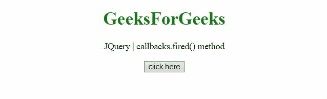

# jQuery 回调. fired()方法

> 原文:[https://www . geesforgeks . org/jquery-回调-激发-方法/](https://www.geeksforgeeks.org/jquery-callbacks-fired-method/)

jQuery **回调. fired()方法**用于检查回调是否已经被调用过至少一次。此方法返回布尔值。

**语法:**

```
callbacks.fired()
```

**参数:**此方法不接受任何参数。

**返回值:**该方法返回一个**布尔值。**

**示例 1:** 此示例返回 true，因为 fire()方法至少被调用过一次。

```
<!DOCTYPE HTML>
<html>

<head>
    <script src=
"https://code.jquery.com/jquery-3.5.0.js">
    </script>
</head>

<body style="text-align:center;">
    <h1 style="color:green;">
        GeeksForGeeks
    </h1>

    <p>
        JQuery | callbacks.fired() method
    </p>

    <button onclick="Geeks();">
        click here
    </button>

    <p id="GFG_DOWN"></p>

    <script>
        var el_down = document.getElementById("GFG_DOWN");
        var res = "";
        var callbacks = jQuery.Callbacks();

        function Geeks() {

            // First function to be added to the list
            var fun1 = function (val) {
                res = res + "This is function 1 and"
                    + " value passed is " + val + "<br>";
            };

            // Adding the function 1
            callbacks.add(fun1);

            // Calling with "GFG_1"
            callbacks.fire("GFG_1");

            // Calling callbacks.fired()
            // method to get true
            el_down.innerHTML = callbacks.fired();
        } 
    </script>
</body>

</html>
```

**输出:**


**示例 2:** 此示例返回 false，因为还没有调用 fire()方法。

```
<!DOCTYPE HTML>
<html>

<head>
    <script src=
"https://code.jquery.com/jquery-3.5.0.js">
    </script>
</head>

<body style="text-align:center;">
    <h1 style="color:green;">
        GeeksForGeeks
    </h1>

    <p>
        JQuery | callbacks.fired() method
    </p>

    <button onclick="Geeks();">
        click here
    </button>

    <p id="GFG_DOWN"></p>

    <script>
        var el_down = document.getElementById("GFG_DOWN");
        var res = "";
        var callbacks = jQuery.Callbacks();

        function Geeks() {

            // First function to be added to the list
            var fun1 = function (val) {
                res = res + "This is function 1 and"
                + " value passed is " + val + "<br>";
            };

            // Adding the function 1
            callbacks.add(fun1);

            // Adding again
            callbacks.add(fun1);

            // Calling callbacks.fired() but 
            // This time we will get false
            el_down.innerHTML = callbacks.fired();
        } 
    </script>
</body>

</html>
```

**输出:**

