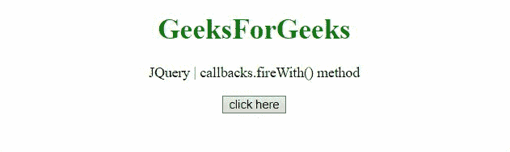

# jQuery 回调. fireWith()方法

> 原文:[https://www . geesforgeks . org/jquery-回调-firewith-method/](https://www.geeksforgeeks.org/jquery-callbacks-firewith-method/)

jQuery 中的**回调. fireWith()** 方法用于调用当前列表中所有具有给定上下文和参数的回调。

**语法:**

```html
callbacks.fireWith([context][, params])

```

**参数:**

*   **上下文:**该参数定义了对应该在其中触发列表中回调的上下文的引用。
*   **参数:**该参数是要传递给列表中回调的参数的数组或类似数组的对象。如果未使用或未定义，将不传递任何参数。

**返回值:**这个方法返回它所附着的回调对象。

**示例 1:** 本示例使用上下文“窗口”，并将参数传递给函数。

```html
<!DOCTYPE HTML>
<html>

<head>
    <script src=
"https://code.jquery.com/jquery-3.5.0.js">
    </script>
</head>

<body style="text-align:center;">
    <h1 style="color:green;">
        GeeksForGeeks
    </h1>

    <p>
        JQuery | callbacks.fireWith() method
    </p>

    <button onclick="Geeks();">
        click here
    </button>

    <p id="GFG_DOWN"></p>

    <script>
        var el_down = document.getElementById("GFG_DOWN");

        var res = "";
        var callbacks = jQuery.Callbacks();

        function Geeks() {

            // First function to be added to the list
            var func = function (val) {
                res = res + "value passed is - " + val;
            };

            // Add the function func to
            // the callbacks list
            callbacks.add(func);

            // Fire the callbacks on the list
            // using the context "window"
            // and an parameters array
            callbacks.fireWith(window, ["gfg_1"]);
            el_down.innerHTML = res;
        } 
    </script>
</body>

</html> 
```

**输出:**


**示例 2:** 本示例使用上下文“窗口”，并将 2 参数传递给函数。

```html
<!DOCTYPE HTML>
<html>

<head>
    <script src=
"https://code.jquery.com/jquery-3.5.0.js">
    </script>
</head>

<body style="text-align:center;">

    <h1 style="color:green;">
        GeeksForGeeks
    </h1>

    <p>
        JQuery | callbacks.fireWith() method
    </p>

    <button onclick="Geeks();">
        click here
    </button>

    <p id="GFG_DOWN"></p>

    <script>
        var el_down = document.getElementById("GFG_DOWN");
        var res = "";
        var callbacks = jQuery.Callbacks();

        function Geeks() {

            // first function to be added to the list
            var func = function (val_1, val_2) {
                res = res + "values passed are - "
                        + val_1 + ", " + val_2;
            };

            // Add the function func to
            // the callbacks list
            callbacks.add(func);

            // Fire the callbacks on the
            // list using the context "window"
            // and an parameters array
            callbacks.fireWith(window, ["gfg_1", "gfg_2"]);
            el_down.innerHTML = res;
        } 
    </script>
</body>

</html>
```

**输出:**
