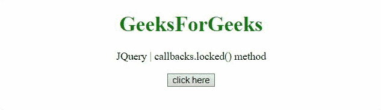

# JQuery 回调. lock()方法

> 原文:[https://www . geesforgeks . org/jquery-回调-锁定-方法/](https://www.geeksforgeeks.org/jquery-callbacks-locked-method/)

jQuery 中的**回调. locked()方法**用于回答回调列表是否被锁定。

**语法:**

```
callbacks.locked()
```

**返回值:**该方法返回一个**布尔值**。

**示例 1:** 在本例中，回调已被锁定，因此方法返回 true。

## 超文本标记语言

```
<!DOCTYPE HTML>
<html>

<head>
    <script src=
"https://code.jquery.com/jquery-3.5.0.js">
    </script>
</head>

<body style="text-align:center;">
    <h1 style="color:green;">
        GeeksForGeeks
    </h1>

    <p>
        jQuery | callbacks.remove() method
    </p>

    <button onclick="Geeks();">
        click here
    </button>

    <p id="GFG"></p>

    <script>
        var el_down = document
                .getElementById("GFG");

        var res = "";
        var callbacks = jQuery.Callbacks();

        function Geeks() {
            var func = function (val) {
                res = res + 
                "value passed is - " + val;
            };

            // Function added to list
            callbacks.add(func);
            callbacks.fire("gfg_1");

            // Locking the callback list
            callbacks.lock();

            // Checking using this method
            el_down.innerHTML = callbacks.locked();
        } 
    </script>
</body>

</html>
```

**输出:**



**示例 2:** 这个示例提供了一个按钮来锁定列表，然后调用方法来查看结果。

## 超文本标记语言

```
<!DOCTYPE HTML>
<html>

<head>
    <script src=
"https://code.jquery.com/jquery-3.5.0.js">
    </script>
</head>

<body style="text-align:center;">

    <h1 style="color:green;">
        GeeksForGeeks
    </h1>

    <p>
        JQuery | callbacks.remove() method
    </p>

    <button onclick="Geeks();">
        click here
    </button>

    <button onclick="lock();">
        lock here
    </button>

    <p id="GFG"></p>

    <script>
        var el_down = document.getElementById("GFG");
        var res = "";
        var callbacks = jQuery.Callbacks();

        // Defining lock function 
        function lock() {
            callbacks.lock();
        }
        function Geeks() {

            // Function to be added to the list
            var fun = function (val) {
                res = res + "This is function "
                    + "and value passed is " 
                    + val + "<br>";
            };

            // Adding
            callbacks.add(fun);
            callbacks.fire("GFG_1");
            el_down.innerHTML = callbacks.locked();
        } 
    </script>
</body>

</html>
```

**输出:**

