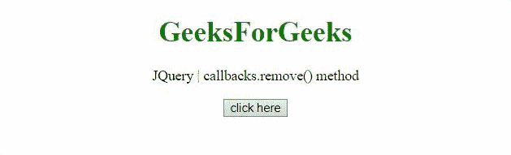
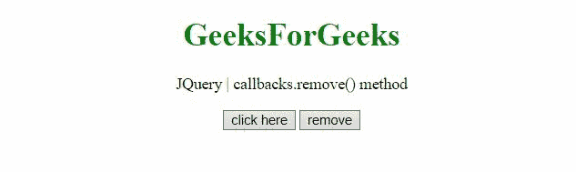

# jQuery 回调. remove()方法

> 原文:[https://www . geesforgeks . org/jquery-回调-移除-方法/](https://www.geeksforgeeks.org/jquery-callbacks-remove-method/)

jQuery **回调. remove()方法**用于从回调列表中移除单个回调或回调集合。

**语法:**

```html
callbacks.remove( callbacks )
```

**参数:**

*   **回调:**此参数指定要从回调列表中删除的函数或函数数组。

**返回值:**这个方法返回它所附着的回调对象。

**示例 1:** 在本例中，有一个 remove 方法用于从列表中删除函数‘func’。

## 超文本标记语言

```html
<!DOCTYPE HTML>
<html>

<head>
    <script src=
"https://code.jquery.com/jquery-3.5.0.js">
    </script>
</head>

<body style="text-align:center;">
    <h1 style="color:green;">
        GeeksForGeeks
    </h1>

    <p>
        jQuery | callbacks.remove() method
    </p>

    <button onclick="Geeks();">
        click here
    </button>

    <p id="GFG"></p>

    <script>
        var el_down = document.getElementById("GFG");
        var res = "";
        var callbacks = jQuery.Callbacks();

        function Geeks() {
            var func = function (val) {
                res = res + "value passed is - " + val;
            };

            // Function added to list
            callbacks.add(func);
            callbacks.fire("gfg_1");

            // Removing the func from list
            callbacks.remove(func);

            // Now This will not work
            callbacks.fire("gfg_2");
            el_down.innerHTML = res;
        } 
    </script>
</body>

</html>
```

**输出:**



**示例 2:** 该示例提供了一个按钮，用于从回调列表中移除函数“fun”。

## 超文本标记语言

```html
<!DOCTYPE HTML>
<html>

<head>
    <script src=
"https://code.jquery.com/jquery-3.5.0.js">
    </script>
</head>

<body style="text-align:center;">

    <h1 style="color:green;">
        GeeksForGeeks
    </h1>

    <p>
        JQuery | callbacks.remove() method
    </p>

    <button onclick="Geeks();">
        click here
    </button>

    <button onclick="remove();">
        remove
    </button>

    <p id="GFG"></p>

    <script>
        var el_down = document.getElementById("GFG");
        var res = "";
        var callbacks = jQuery.Callbacks();

        var fun = function (val) {
            res = res + "This is function and "
                + "value passed is " + val + "<br>";
        };

        // Adding function to Callback list
        callbacks.add(fun);

        // Defining function to remove
        function remove() {
            callbacks.remove(fun);
        }

        function Geeks() {
            callbacks.fire("GFG_1");
            el_down.innerHTML = res;
        } 
    </script>
</body>

</html>
```

**输出:**函数从回调列表中删除。

