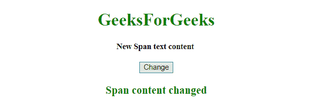

# JQuery |更改跨度元素的文本

> 原文:[https://www . geesforgeks . org/jquery-change-the-text-of-span-element/](https://www.geeksforgeeks.org/jquery-change-the-text-of-a-span-element/)

给定一个 HTML 文档，任务是更改一个元素的文本内容。有多种方法可用于改变跨度元素，讨论如下:

*   **jQuery text() Method:** This method set/return the text content of specified elements. If this method is used to return content, it returns the text content of all matched elements (HTML tags will be removed). If this method is used to set content, it overwrites the content of all matched elements.

    **语法:**

    *   **返回文本内容。**

        ```
        $(selector).text()
        ```

    *   **设置文字内容。**

        ```
        $(selector).text(content)
        ```

    *   **使用功能设置文本内容。**

        ```
        $(selector).text(function(index, curContent))
        ```

    **参数:**

    *   **内容:**必输参数。它为选定的元素指定新的文本内容。
    *   **函数(index，curContent):** 为可选参数。它指定为选定元素返回新文本内容的函数。
    *   **索引:**返回元素在集合中的索引位置。
    *   **curContent:** 返回当前选中元素的内容。
*   **jQuery html()方法:**该方法设置/返回指定元素的内容(html)。如果此方法用于返回内容，它将返回第一个匹配元素的内容。如果此方法用于设置内容，它将覆盖所有匹配元素的内容。

**语法:**

*   **返回内容**

    ```
    $(selector).html()

    ```

*   **设置内容**

    ```
    $(selector).html(content)

    ```

*   **使用功能**

    ```
    $(selector).html(function(index, curContent))

    ```

    设置内容

**参数:**

*   **内容:**必输参数。它为包含 HTML 标记的选定元素指定新的文本内容。
*   **函数(index，curContent):** 为可选参数。它指定为选定元素返回新内容的函数。

*   **索引:**返回元素在集合中的索引位置。
*   **curContent:** 返回当前选中元素的 HTML 内容。

**示例 1:** 本示例使用 **JQuery 的 text()方法**更改内容。

```
<!DOCTYPE HTML> 
<html> 
    <head> 
        <title> 
            JQuery | Change the text of a span element
        </title>

        <script src = 
"https://ajax.googleapis.com/ajax/libs/jquery/3.4.0/jquery.min.js">
        </script>
    </head> 

    <body style = "text-align:center;" id = "body"> 

        <h1 style = "color:green;" > 
            GeeksForGeeks 
        </h1> 

        <span id="GFG_Span" style = "font-size: 15px; font-weight: bold;"> 
            This is text of Span element. 
        </span>

        <br><br>

        <button> 
            Change
        </button>

        <p id = "GFG_DOWN" style = 
            "color:green; font-size: 20px; font-weight: bold;">
        </p>

        <script>
            $('button').on('click', function() {
                $('#GFG_Span').text("New Span text content");
                $('#GFG_DOWN').text("Span content changed");
            });     
        </script> 
    </body> 
</html>                    
```

**输出:**

*   **点击按钮前:**
    
*   **点击按钮后:**
    

**示例 2:** 本示例使用 **JQuery 的 html()方法**更改内容。

```
<!DOCTYPE HTML> 
<html> 
    <head> 
        <title> 
            JQuery | Change the text of a span element
        </title>

        <script src = 
"https://ajax.googleapis.com/ajax/libs/jquery/3.4.0/jquery.min.js">
        </script>
    </head> 

    <body style = "text-align:center;" id = "body"> 

        <h1 style = "color:green;" > 
            GeeksForGeeks 
        </h1> 

        <span id="GFG_Span" style = "font-size: 15px; font-weight: bold;">
             This is text of Span element. 
        </span>

        <br><br>

        <button> 
            Change
        </button>

        <p id = "GFG_DOWN" style = 
            "color:green; font-size: 20px; font-weight: bold;">
        </p>

        <script>
            $('button').on('click', function() {
                $('#GFG_Span').html("<p>New Span text content</p>");
                $('#GFG_DOWN').text("Span content changed");
            });     
        </script> 
    </body> 
</html>                    
```

**输出:**

*   **点击按钮前:**
    
*   **点击按钮后:**
    