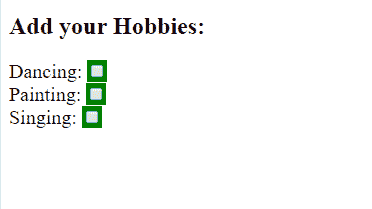

# jQuery |:复选框选择器

> 原文:[https://www.geeksforgeeks.org/jquery-checkbox-selector/](https://www.geeksforgeeks.org/jquery-checkbox-selector/)

**复选框**是与用户进行交互的一个非常重要的元素。在 JQuery 中，我们可以构建一个简单的复选框来允许数据输入。

**语法:**

```
$(":checkbox")
```

我们可以实现代码中的复选框:
**示例:**

```
<!DOCTYPE html>
<html>

<head>
    <script src=
"https://ajax.googleapis.com/ajax/libs/jquery/3.3.1/jquery.min.js">
  </script>

  <style>
        p {
            font-size: 20px
        }
    </style>
    <script>
        $(document).ready(function() {
            $(":checkbox").wrap(
            "<span style='background-color:green'>");
        });
    </script>
</head>

<body>

    <h2>Add your Hobbies:</h2>
    <p>Dancing:
        <input type="checkbox"
               name="hobbies" 
               value="dancing">
        <br> Painting:

        <input type="checkbox"
               name="hobbies"
               value="painting">
        <br> Singing:

        <input type="checkbox"
               name="hobbies" 
               value="singing">
        <br>
    </p>

</body>

</html>
```

**输出:**
