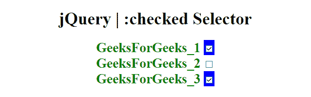
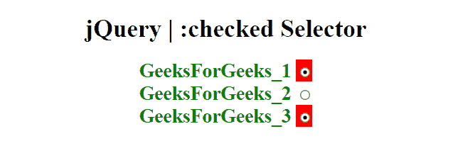

# jQuery |:选中的选择器

> 原文:[https://www.geeksforgeeks.org/jquery-checked-selector/](https://www.geeksforgeeks.org/jquery-checked-selector/)

**:选中选择器**用于选择所有选中的复选框、单选按钮和选择元素的选项。

**注意:**要仅检索选择元素的选定选项，请使用:选定选择器。

**语法:**

```
$(":checked")
```

以下示例说明了 jQuery 中的**:选中的选择器**:

**示例 1:** 本示例将 CSS 应用于所有选中的元素(在本例中为复选框)。

```
<!DOCTYPE html>  
<html>  

<head> 
    <title> 
        jQuery | :checked Selector
    </title>

    <script src=
"https://ajax.googleapis.com/ajax/libs/jquery/3.3.1/jquery.min.js">
    </script>

    <!-- Script to set style in checked selector -->
    <script>
        $(document).ready(function() {
            $(":checked").wrap("<span style='background-color:blue'>");
        });
    </script>

    <style>
        form {
            font-weight: bold;
            font-size: 25px;
            color: green;
        }
    </style>
</head> 

<body style="text-align:center;">  

    <h1>  
        jQuery | :checked Selector
    </h1>  

    <form action="">
        GeeksForGeeks_1 <input type="checkbox" name="GFG_1"
                value="GFG_1" checked="checked" ><br>

        GeeksForGeeks_2 <input type="checkbox" name="GFG_2"
                value="GFG_2"  ><br>
        GeeksForGeeks_3 <input type="checkbox" name="GFG_3"
                value="GFG_3" checked="checked" ><br>
    </form> 
</body>  

</html>  
```

**输出:**


**示例 2:** 本示例在单选按钮上使用选中的选择器。

```
<!DOCTYPE html>  
<html>  

<head> 
    <title> 
        jQuery | :checked Selector
    </title>

    <script src=
"https://ajax.googleapis.com/ajax/libs/jquery/3.3.1/jquery.min.js">
    </script>

    <!-- Script to set style in checked selector -->
    <script>
        $(document).ready(function() {
            $(":checked").wrap("<span style='background-color:red'>");
        });
    </script>

    <style>
        form {
            font-weight: bold;
            font-size: 25px;
            color: green;
        }
    </style>

</head> 

<body style="text-align:center;">  

    <h1>  
        jQuery | :checked Selector
    </h1>  

    <form action="">
        GeeksForGeeks_1 <input type="radio" name="GFG_1"
                value="GFG_1" checked="checked" ><br>

        GeeksForGeeks_2 <input type="radio" name="GFG_2"
                value="GFG_2"  ><br>

        GeeksForGeeks_3 <input type="radio" name="GFG_3"
                value="GFG_3" checked="checked" ><br>
    </form> 
</body>  

</html>    
```

**输出:**
