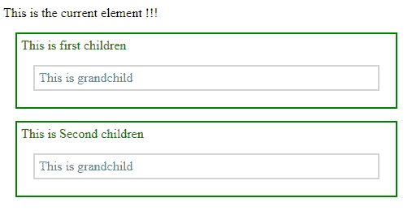
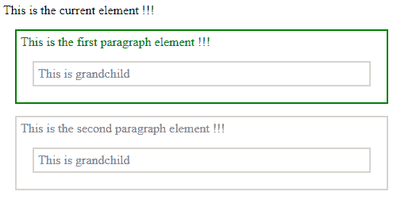

# jQuery | children()带示例

> 原文:[https://www . geeksforgeeks . org/jquery-带例子的孩子/](https://www.geeksforgeeks.org/jquery-children-with-examples/)

[**children()**](https://www.geeksforgeeks.org/jquery-children-with-examples/) 是 **jQuery** 中的一个内置方法，用于查找与所选元素相关的所有子元素。jQuery 中的 children()方法向下遍历到所选元素的单个级别，并返回所有元素。

**语法:**

```
$(selector).children()

```

这里的选择器是将要找到其子元素的选定元素。
**参数:**不接受任何参数。
**返回值:**返回所选元素的所有子元素。

<center>**jQuery code to show the working of this function:**</center>

**Code #1:** In the below code, all the elements directly connected to the “div” element get highlighted with the green color.

```
<html>

<head>
    <style>
        .parent * {
            display: block;
            border: 2px solid lightgrey;
            color: grey;
            padding: 5px;
            margin: 15px;
        }
    </style>
    <script src="https://ajax.googleapis.com/ajax/libs/
                jquery/3.3.1/jquery.min.js"></script>
    <script>
        $(document).ready(function() {
            $("div").children().css({
                "color": "green",
                "border": "2px solid green"
            });
        });
    </script>
</head>

<body>

    <div class="parent" style="width:500px;">This is the current element !!!
        <p>This is first children
            <span>This is grandchild</span>
        </p>
        <p>This is Second children
            <span>This is grandchild</span>
        </p>
    </div>

</body>

</html>
```

**输出:**


一个可选参数也可以用于 children()方法，以过滤对 children 元素的搜索。
**语法:**

```
$(selector1).children("selector2")

```

这里 selector1 是将要找到其子元素的选定元素。
**参数:**它接受下面指定的参数-

*   **selector2:** This is the prior children among all the children of the selected element.

    **返回值:**返回所选元素的前一个子元素。

    **代码#2:** 在下面的代码中，在所有段落元素中，第一段的元素被选中并以绿色突出显示。

    ```
    <html>

    <head>
        <style>
            .descendants * {
                display: block;
                border: 2px solid lightgrey;
                color: grey;
                padding: 5px;
                margin: 15px;
            }
        </style>
        <script src="https://ajax.googleapis.com/ajax/libs/
                     jquery/3.3.1/jquery.min.js"></script>
        <script>
            $(document).ready(function() {
                $("div").children("p.first").css({
                    "color": "green",
                    "border": "2px solid green"
                });
            });
        </script>
    </head>

    <body>

        <div class="descendants" style="width:500px;">This is the current element !!!
            <p class="first">This is the first paragraph element !!!
                <span>This is grandchild</span>
            </p>
            <p class="second">This is the second paragraph element !!!
                <span>This is grandchild</span>
            </p>
        </div>

    </body>

    </html>
    ```

    **输出:**
    

    jQuery 是一个开源的 JavaScript 库，它简化了 HTML/CSS 文档之间的交互，它以其“少写多做”的理念而闻名。
    跟随本 [jQuery 教程](https://www.geeksforgeeks.org/jquery-tutorials/)和 [jQuery 示例](https://www.geeksforgeeks.org/jquery-examples/)可以从头开始学习 jQuery。