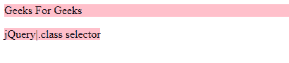
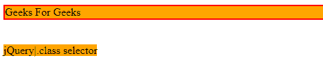

# jQuery |。类别选择器

> 原文:[https://www.geeksforgeeks.org/jquery-class-selector/](https://www.geeksforgeeks.org/jquery-class-selector/)

**。类**选择器为要选择的元素指定类。它不应该以数字开头。它为几个 HTML 元素赋予了样式。

**语法:**

```
$(".class")
```

**示例-1:**

```
<!DOCTYPE html>
<html>

<head>
    <script src=
"https://ajax.googleapis.com/ajax/libs/jquery/3.3.1/jquery.min.js">
  </script>
    <script>
      $(document).ready(function() {
        $(".GEEKS").css("background-color"
                        , "pink");
        });
    </script>
</head>

<body>

    <p class="GEEKS">Geeks For Geeks
  </p>

    <span class="GEEKS">jQuery|.class selector
  </span>

</body>

</html>
```

**输出:**


**示例-2:**

```
<!DOCTYPE html>
<html>

<head>
    <script src=
"https://ajax.googleapis.com/ajax/libs/jquery/3.3.1/jquery.min.js">
  </script>

  <script>
      $(document).ready(function() {
       $(".GEEKS").css("background-color",
                          "orange");
        });
    </script>
</head>

<body>

    <div style="border:2px solid red"
         class="GEEKS">
      Geeks For Geeks
  </div>
    <br>
    <br>

    <span class="GEEKS">jQuery|.class selector
  </span>

</body>

</html>
```

**输出:**


**支持的浏览器:**

*   谷歌 Chrome
*   Mozilla Firefox
*   边缘
*   旅行队
*   歌剧