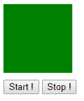
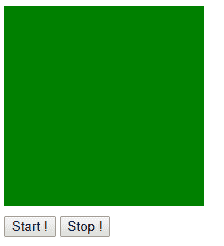
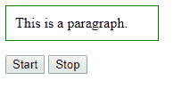
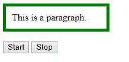

# jQuery | clearQueue()带示例

> 原文:[https://www . geeksforgeeks . org/jquery-clearqueue-with-examples/](https://www.geeksforgeeks.org/jquery-clearqueue-with-examples/)

clearQueue()方法从队列中移除所有尚未运行的项目。注意，当一个函数已经开始运行时，**它会一直运行到完成。**
**语法:**

```
$(selector).clearQueue(name);

```

这里的“选择器”是被选择的元素。
**参数:**它接受一个参数“名称”，这是函数的名称。
**返回值:**返回已删除功能的选中元素。

<center>**jQuery code to show the working of clearQueue() method:**</center>

**Code #1:**
In the below code, animation method is cleared.

```
<html>

<head>
    <script src="https://code.jquery.com/jquery-1.10.2.js">
    </script>
    <script>
        <!-- jQuery code to demonstrate clearQueue method -->
        $(document).ready(function() {
            <!-- click button to start animation -->
            $("#b1").click(function() {
                $("div").animate({
                    height: 200
                }, 2000);
                $("div").animate({
                    width: 200
                }, 2000);
                $("div").animate({
                    height: 100
                }, 2000);
                $("div").animate({
                    width: 100
                }, 2000);
                $("div").animate({
                    height: 200
                }, 2000);
                $("div").animate({
                    width: 200
                }, 2000);
                $("div").animate({
                    height: 100
                }, 2000);
                $("div").animate({
                    width: 100
                }, 2000);
            });
            <!-- button to stop animation -->
            $("#b2").click(function() {
                $("div").clearQueue();
            });
        });
    </script>
    <style>
        div {
            background: green;
            height: 100px;
            width: 100px;
        }

        button {
            margin-top: 10px;
        }
    </style>
</head>

<body>
    <div></div>
    <!-- click on this button to start the animation -->
    <button id="b1">Start !</button>
    <!-- click on this button to stop the animation at 
             given situation -->
    <button id="b2">Stop !</button>
</body>

</html>
```

**输出:**
点击任意按钮前-

点击“开始！”过了一会儿“停！”
按钮-

**代码#2:**

```
<html>

<head>
    <script src="https://ajax.googleapis.com/ajax/libs/
              jquery/3.3.1/jquery.min.js"></script>
    <script>
        <!-- jQuery code to demonstrate clearQueue method -->
        $(document).ready(function() {
            $(".b1").click(function() {
                $("p").animate({
                    borderRightWidth: "5px"
                });
                $("p").animate({
                    borderTopWidth: "5px"
                });
                $("p").animate({
                    borderLeftWidth: "5px"
                });
                $("p").animate({
                    borderBottomWidth: "5px"
                });
            });
            $(".b2").click(function() {
                $("p").clearQueue();
            });
        });
    </script>
    <style>
        p {
            display: block;
            width: 150px;
            border: 1px solid green;
            padding: 10px;
        }
    </style>
</head>

<body>
    <p>This is a paragraph.</p>
    <!-- click on this button to start the animation -->
    <button class="b1">Start</button>
    <!-- click on this button to stop the animation 
            at given situation -->
    <button class="b2">Stop</button>
</body>

</html>
```

**输出:**
点击任意按钮前-


点击“开始！”过了一会儿“停！”按钮-
