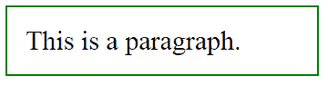
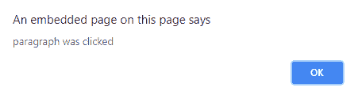
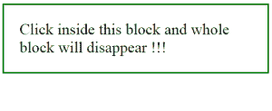

# jQuery |点击()附带示例

> 原文:[https://www.geeksforgeeks.org/jquery-click-with-examples/](https://www.geeksforgeeks.org/jquery-click-with-examples/)

**click()** 是 jQuery 中的一个内置方法，它启动 click 事件或附加一个函数，以便在 click 事件发生时运行。
**语法:**

```
$(selector).click(function);

```

**参数:**接受一个可选参数“function”，用于点击事件发生时运行。
**返回值:**返回指定函数要执行的选中元素。

<center>**jQuery 代码显示点击()方法的工作方式:**</center>

**代码#1:**
在下面的代码中，没有函数被传递给这个方法。

```
<html>

<head>
    <script 
    src="https://ajax.googleapis.com/ajax/libs/jquery/3.3.1/jquery.min.js">
    </script>
    <!-- jQuery code to show the working of this method -->
    <script>
        $(document).ready(function() {
            $("p").click();
        });
    </script>
    <style>
        p {
            display: block;
            width: 300px;
            padding: 20px;
            font-size: 30px;
            border: 2px solid green;
        }
    </style>
</head>

<body>
    <!-- click on this method -->
    <p onclick="alert('paragraph was clicked')">This is a paragraph.</p>
</body>

</html>
```

**输出:**
两个输出同时生成-




**代码#2:**
在下面的代码中，函数被传递给这个方法。

```
<html>

<head>
    <script 
    src="https://ajax.googleapis.com/ajax/libs/jquery/3.3.1/jquery.min.js">
    </script>
    <script>
        <!-- jQuery code to show the working of this method -->
        $(document).ready(function() {
            $("p").click(function() {
                $(this).fadeOut();
            });
        });
    </script>
    <style>
        p {
            display: block;
            width: 370px;
            padding: 25px;
            font-size: 25px;
            border: 2px solid green;
        }
    </style>
</head>

<body>
    <!-- click on this paragraph and the paragraph will disappear -->
    <p>Click inside this block and whole block will disappear !!!</p>
</body>

</html>
```

**输出:**
点击区块内部前-


点击块内-
后

jQuery 是一个开源的 JavaScript 库，它简化了 HTML/CSS 文档之间的交互，它以其“少写多做”的理念而闻名。
跟随本 [jQuery 教程](https://www.geeksforgeeks.org/jquery-tutorials/)和 [jQuery 示例](https://www.geeksforgeeks.org/jquery-examples/)可以从头开始学习 jQuery。