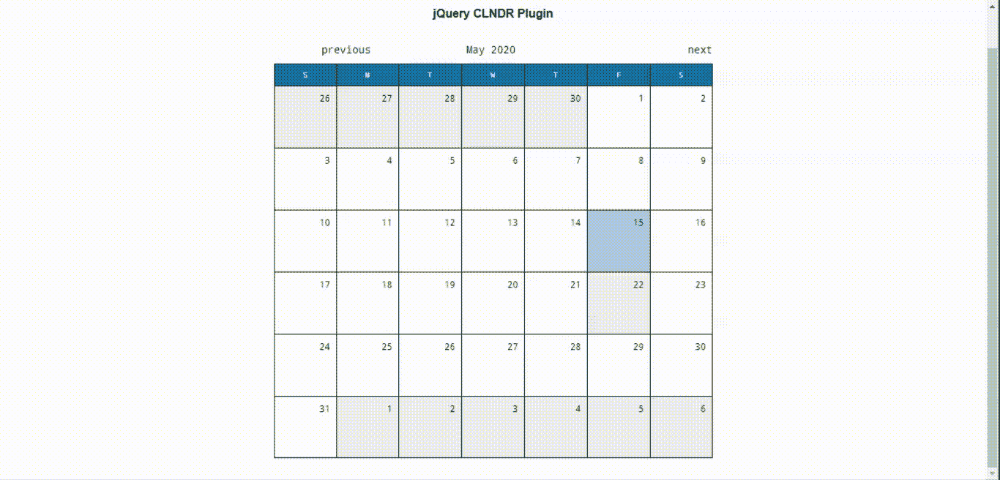
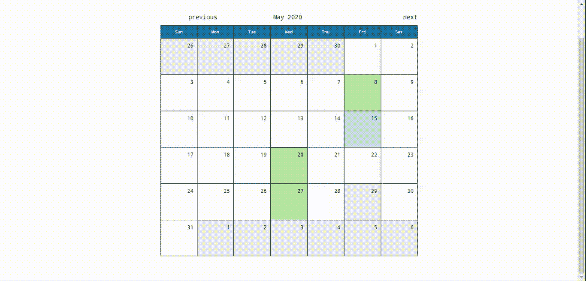
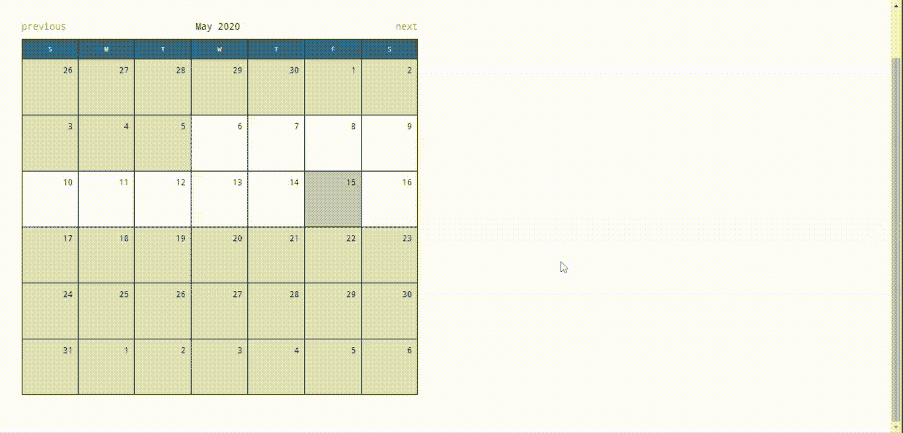

# jQuery | CLNDR 插件

> 哎哎哎::1230【https://www . geeksforgeeks . org/jquery-clndr 插件/

[**jQuery**](https://www.geeksforgeeks.org/jquery-tutorials/) 提供前端日历 **CLNDR** 插件使用的 HTML 模板多用于单日或多日事件管理系统。它用于以日历格式指定各种事件的日期。
你必须在工作文件夹中下载需要的文件，这样程序员就可以把它包含在 HTML 结构页面的头部，如下面的程序中实现的那样。
**注意:**在头部包含**【下划线. js】**和**【矩. js】**库，在【clndr.js】之前作为 **CLNDR** 插件就靠这些库。[下载 **CLNDR** 插件的链接](https://github.com/kylestetz/CLNDR)。
**示例 1:** 以下示例演示了以日历格式显示当前月份的 **CLNDR** 插件的基本用法。像“显示相邻月份”和“相邻日期日历月”这样的选项被设置为**真**，以便快速轻松地遍历前几个月和后几个月。

## 超文本标记语言

```html
<!DOCTYPE html>
<html>
    <head>
        <title>jQuery Calendar Plugin</title>
        <meta charset="UTF-8" />
        <link rel="stylesheet" href="clndr.css" />

        <script src=
"https://cdnjs.cloudflare.com/ajax/libs/jquery/1.11.3/jquery.min.js">
       </script>
        <script src=
"https://cdnjs.cloudflare.com/ajax/libs/underscore.js/1.8.3/underscore-min.js">
        </script>
        <script src=
"https://cdnjs.cloudflare.com/ajax/libs/moment.js/2.10.6/moment.min.js">
        </script>
        <script src="clndr.js"></script>
        <style>
            body {
                font-family: Arial;
                text-align: center;
            }
        </style>
    </head>
    <body>
        <h1 style="color: green;">GeeksForGeeks</h1>
        <b>jQuery CLNDR Plugin</b>
        <div class="container">
            <div class="cal1"></div>
        </div>

        <script>
            var calendar = {};
            $(document).ready(function () {
                calendar.clndr = $(".cal1").clndr({

                   // Able to display adjacent months
                    showAdjacentMonths: true,

                  // Visible adjacent days will show
                  // corresponding month on click
                    adjacentDaysChangeMonth: true,
                });

                // Going forward monthwise
                calendar.forward();
                // Going back to previous month
                calendar.back();
            });
        </script>
    </body>
</html>
```

**输出:**



**示例 2:** 以下示例演示了使用 **CLNDR** 插件传递事件以显示信息。在 jQuery 代码中，事件列表以数组的形式传递给 CLNDR click 事件。一旦用户点击事件日期，它就会以“红色”显示日期，并在底部显示事件标题。一周中的几天也以特定的格式设置。程序员可以根据应用需求设置其他选项。

## 超文本标记语言

```html
<html>
    <head>
        <title>jQuery CLNDR Plugin</title>
        <meta charset="UTF-8" />
        <link rel="stylesheet" href="clndr.css" />

        <script src=
"https://cdnjs.cloudflare.com/ajax/libs/jquery/1.11.3/jquery.min.js">
        </script>
        <script src=
"https://cdnjs.cloudflare.com/ajax/libs/underscore.js/1.8.3/underscore-min.js">
        </script>
        <script src=
"https://cdnjs.cloudflare.com/ajax/libs/moment.js/2.10.6/moment.min.js">
        </script>
        <script src="clndr.js"></script>
        <style>
            body {
                font-family: Arial;
                text-align: center;
            }

            div#eventInfoID {
                margin-top: 5px;
                width: 90%;
                text-align: center;
                font-weight: bold;
                padding: 10px;
                box-sizing: content-box;
            }
        </style>
    </head>
    <body>
        <h1 style="color: green;">GeeksForGeeks</h1>
        <b>jQuery CLNDR Plugin</b>
        <div class="container">
            <div class="cal1"></div>
            <div id="eventInfoID"><b></b></div>
        </div>

        <script>
            var calendar = {};
            $(document).ready(function () {
                var eventsList = [
                    {
                        date: "2020-05-08",
                        title: "Open lecture on web",
                    },
                    {
                        date: "2020-05-20",
                        title: "Another Long Event",
                    },
                    {
                        title: "Birthday Party",
                        date: "2020-05-27",
                    },
                ];

                calendar.clndr = $(".cal1").clndr({

                    // Displays days of the week in given format
                    daysOfTheWeek: ["Sun", "Mon", "Tue",
                                    "Wed", "Thu", "Fri", "Sat"],
                    events: eventsList,
                    clickEvents: {
                        click: function (target) {
                            $(".day .day-contents").css("color", "#000");

                            // Displays the event date in red, once clicked
                            $(".calendar-day-" + target["date"]["_i"] + " .day-contents")
                              .css("color", "#FF0000");
                            var titleInfo = target.events[0].title;
                            $("#eventInfoID").text(titleInfo);
                        },
                    },
                    showAdjacentMonths: true,
                    adjacentDaysChangeMonth: false,
                });
            });
        </script>
    </body>
</html>
```

**输出:**CLNDR 插件还可以通过访问数组对象中事件的**开始**和**结束**日期，以类似于单日事件的方式处理多日事件。



**示例 3:** 以下示例演示了带有一些约束的 **CLNDR** 插件，例如在日历中选择特定范围内的日期。它有助于处理 web 应用程序中的大量用户和日期验证。

## 超文本标记语言

```html
<!DOCTYPE html>
<html>
    <head>
        <title>jQuery CLNDR plugin</title>
        <meta charset="UTF-8" />
        <link rel="stylesheet" href="clndr.css" />
        <script src=
"https://cdnjs.cloudflare.com/ajax/libs/jquery/1.11.3/jquery.min.js">
        </script>
        <script src=
"https://cdnjs.cloudflare.com/ajax/libs/underscore.js/1.8.3/underscore-min.js">
        </script>
        <script src=
 "https://cdnjs.cloudflare.com/ajax/libs/moment.js/2.10.6/moment.min.js">
        </script>
        <script src="clndr.js"></script>
        <style>
            body {
                font-family: Arial;
            }
            .msg-row {
                padding: 5px;
            }
            .container {
                width: 650px;
            }
            #constraintInfoID {
                margin-top: 5px;
                margin-left: 5px;
                width: 600px;
                text-align: center;
                font-weight: bold;
                padding: 10px 10px;
                box-sizing: content-box;
            }
        </style>
    </head>
    <body>
        <h1 style="color: green;">GeeksForGeeks</h1>
        <b>jQuery CLNDR Plugin</b>
        <div class="container">
            <div id="calendarID" class="cal1"></div>
            <div id="constraintInfoID"></div>
        </div>

        <script>
            var calendar = {};
            $(document).ready(function () {
                calendar.clndr = $("#calendarID").clndr({
                    constraints: {
                        startDate: "2020-05-06",
                        endDate: "2020-05-16",
                    },
                    clickEvents: {
                        click: function (target) {
                            if (!$(target.element).hasClass("inactive")) {
                                var msg = "Valid date within the constraints!";
                                $("#constraintInfoID")
                                  .append("<div class='msg-row'
                                                style='background-color:green'>"
                                          + msg + "</div>");
                            } else {
                                var msg = "Date chosen is outside the constraint range";
                                $("#constraintInfoID")
                                  .append("<div class='msg-row'
                                                style='background-color:red'>"
                                          + msg + "</div>");
                            }
                        },
                    },
                });
            });
        </script>
    </body>
</html>
```

**输出:**

