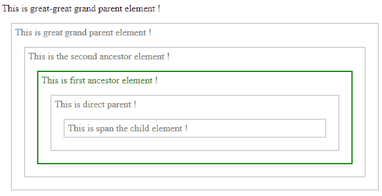
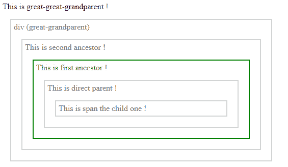

# jQuery |最接近()带示例

> 原文:[https://www.geeksforgeeks.org/jquery-closest-with-examples/](https://www.geeksforgeeks.org/jquery-closest-with-examples/)

最接近的()是 jQuery 中的一个内置方法，它返回 DOM 树中所选元素的第一个祖先。此方法从当前元素向上遍历，搜索元素的第一个祖先。文档对象模型是一个万维网联盟标准。这定义了访问 DOM 树中的元素。
**语法:**

```html
$(selector).closest(para1, para2);

```

**参数:**接受以下指定的两个参数-

*   **para1:** 指定在 DOM 树中叙述祖先搜索的元素。
*   **para2:** 这是一个可选的参数 DOM 元素，在其中找到了一个匹配的元素。

**返回值:**返回所选元素的第一个祖先。

<center>**jQuery code to show the working of closest() method:**</center>

**Code #1:**
In the below code, optional parameter is not passed.

```html
<html>

<head>
    <style>
        .main * {
            display: block;
            border: 2px solid lightgrey;
            color: grey;
            padding: 5px;
            margin: 15px;
        }
    </style>
    <script src="https://ajax.googleapis.com/ajax/libs/
               jquery/3.3.1/jquery.min.js"></script>
    <script>
    <!-- here is the script code for performing the method -->
        $(document).ready(function() {
            $("span").closest("ul").css({
                "color": "green",
                "border": "2px solid green"
            });
        });
    </script>
</head>

<body class="main">
    This is great-great grand parent element !
    <div style="width:600px;">
        This is great grand parent element !
        <ul>
            This is the second ancestor element !
            <ul>
                <!-- This element will be selected -->
                This is first ancestor element !
                <li>This is direct parent !
                <span>This is span the child element !</span>
                </li>
            </ul>
        </ul>
    </div>
</body>

</html>
```

**输出:**

**代码#2:**
在下面的代码中，可选参数被传递给方法。

```html
<html>

<head>
    <style>
        .main * {
            display: block;
            border: 2px solid lightgrey;
            color: grey;
            padding: 5px;
            margin: 15px;
        }
    </style>
    <script src="https://ajax.googleapis.com/ajax/libs/
             jquery/3.3.1/jquery.min.js"></script>
    <script>
        $(document).ready(function() {
        <!--Here among dom id first ancestor will select -->
            var item = document.getElementById("dom");
            $("li").closest("ul", item).css({
                "color": "green",
                "border": "2px solid green"
            });
        });
    </script>
</head>

<body class="main">
    This is great-great-grandparent !
    <div style="width:500px;">
        div (great-grandparent)
        <ul id="dom">
            This is second ancestor !
            <ul id="dom">
                This is first ancestor !
                <li>This is direct parent !
                <span>This is span the child one !</span>
                </li>
            </ul>
        </ul>
    </div>
</body>

</html>
```

**输出:**


jQuery 是一个开源的 JavaScript 库，它简化了 HTML/CSS 文档之间的交互，它以其“少写多做”的理念而闻名。
跟随本 [jQuery 教程](https://www.geeksforgeeks.org/jquery-tutorials/)和 [jQuery 示例](https://www.geeksforgeeks.org/jquery-examples/)可以从头开始学习 jQuery。