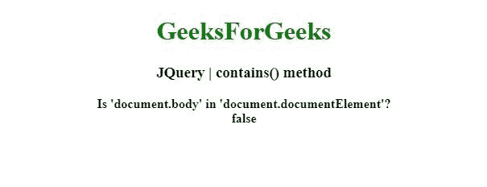

# jQuery |包含()方法

> 原文:[https://www.geeksforgeeks.org/jquery-contains-method/](https://www.geeksforgeeks.org/jquery-contains-method/)

jQuery 中的这个 **contains()** 方法用于检查一个 DOM 元素是否是另一个 DOM 元素的后代。

**语法:**

```
jQuery.contains( container, contained )

```

**参数:**该方法接受两个参数，如上所述，如下所述:

*   **容器:**此参数保存可能包含另一个元素的 DOM 元素。
*   **contained:** 这个参数保存了另一个元素(的后代)可能包含的 DOM 元素。

**返回值:**返回布尔值。

以下示例说明了 jQuery.contains()方法的使用:

**例 1:**

```
<!DOCTYPE html>
<html>

<head>
    <meta charset="utf-8">
    <title>JQuery | contains() method</title>

    <script src=
        "https://code.jquery.com/jquery-3.4.1.js">
    </script>
</head>

<body style="text-align:center;">

    <h1 style="color: green">
        GeeksForGeeks
    </h1>

    <h3>JQuery | contains() method</h3>

    <b id="gfg"></b>

    <script>
        $("#gfg").append(
            "Is 'document.documentElement' in 'document.body'? <br>"
            + $.contains(document.documentElement, document.body));

    </script>
</body>

</html>
```

**输出:**


**例 2:**

```
<!DOCTYPE html>
<html>

<head>
    <meta charset="utf-8">
    <title>JQuery | contains() method</title>

    <script src=
        "https://code.jquery.com/jquery-3.4.1.js">
    </script>

</head>

<body style="text-align:center;">

    <h1 style="color: green">
        GeeksForGeeks
    </h1>

    <h3>JQuery | contains() method</h3>

    <b id="gfg"></b>

    <script>
        $("#gfg").append(
            "Is 'document.body' in 'document.documentElement'? <br>"
            + $.contains(document.body, document.documentElement));
    </script>
</body>

</html>
```

**输出:**
