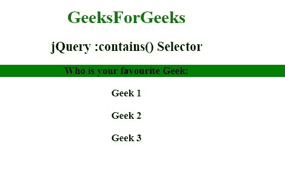
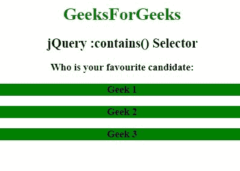

# jQuery |:包含()选择器

> 原文:[https://www.geeksforgeeks.org/jquery-contains-selector/](https://www.geeksforgeeks.org/jquery-contains-selector/)

jQuery 中的 **:contains()选择器**用于选择包含指定字符串的元素。

**语法:**

```html
$(":contains(text)")
```

**参数:**该选择器包含单个参数**文本**，该参数为必选项，用于指定要查找的文本。

**示例 1:** 本示例使用:contains()选择器选择元素。

```html
<!DOCTYPE html>
<html>
   <head>
      <title>jQuery :contains() Selector</title>

      <script src=
"https://ajax.googleapis.com/ajax/libs/jquery/3.3.1/jquery.min.js">
      </script>

      <!-- Script to use :contains selector -->
      <script>
         $(document).ready(function(){
           $("h3:contains(is)").css("background-color", "green");
         });
      </script>
   </head>

   <body>
      <center>
         <h1 id="geeks1" style = "color:green;">GeeksForGeeks</h1>
         <h2 id="geeks2">jQuery :contains() Selector</h2>
         <h3>Who is your favourite Geek:</h3>

         <div id="choose">
             <h3>Geek 1</h3>
             <h3>Geek 2</h3>
             <h3>Geek 3</h3>
         </div>
      </center>
   </body>
</html>
```

**输出:**


**示例 2:** 本示例使用:contains()选择器选择元素。

```html
<!DOCTYPE html>
<html>
   <head>
      <title>jQuery :contains() Selector</title>

      <script src=
"https://ajax.googleapis.com/ajax/libs/jquery/3.3.1/jquery.min.js">
      </script>

      <!-- Script to use :contains selector -->
      <script>
         $(document).ready(function(){
           $("h3:contains(Geek)").css("background-color", "green");
         });
      </script>
   </head>
   <body>
      <center>
         <h1 id="geeks1" style = "color:green;">GeeksForGeeks</h1>
         <h2 id="geeks2">jQuery :contains() Selector</h2>
         <h3>Who is your favourite candidate:</h3>

         <div id="choose">
             <h3>Geek 1</h3>
             <h3>Geek 2</h3>
             <h3>Geek 3</h3>
         </div>
      </center>
   </body>
</html>
```

**输出:**
