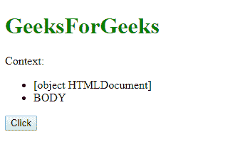

# jQuery |上下文属性

> 原文:[https://www.geeksforgeeks.org/jquery-context-property/](https://www.geeksforgeeks.org/jquery-context-property/)

**DOM 节点上下文**包含传递给 jQuery()的原始，这是一个 DOM 节点上下文，如果没有传递节点，那么上下文就是文档。

**语法:**

```html
context
```

**示例:**

```html
<!DOCTYPE html>
<html>

<head>
    <meta charset="utf-8">
    <title>
      context demo
  </title>
    <script src=
            "https://code.jquery.com/jquery-1.10.2.js">
  </script>

  <script>
    $(document).ready(function() {
        $("button").click(function() {
            $("ul")
             .append("<li>" + $("ul")
                   .context + "</li>")

             .append("<li>" + $("ul", document.body)
                   .context.nodeName + "</li>");
            });
        });
    </script>
</head>

<body>

    <h1 style="color:green;"> 
GeeksForGeeks 
</h1> Context:
    <ul></ul>
    <button>Click</button>

</body>

</html>
```

**输出:**
**点击前:**


**点击后:**


**注意:**在 jQuery 版本中上下文属性被移除。