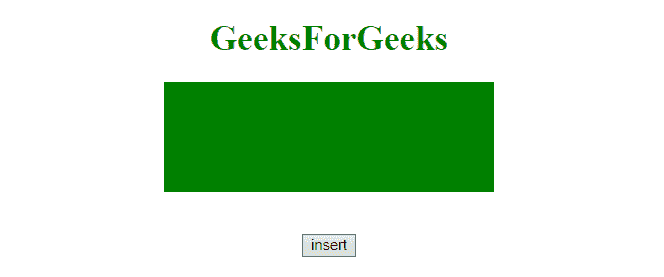
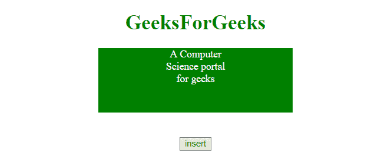

# jQuery |创建 div 元素

> 原文:[https://www.geeksforgeeks.org/jquery-create-a-div-element/](https://www.geeksforgeeks.org/jquery-create-a-div-element/)

使用 jQuery 创建

元素可以通过以下步骤完成:

**步骤:**

*   创建新的元素。
*   选择一个父元素，将这个新创建的元素放在哪里。
*   将创建的 div 元素放入父元素。

**示例 1:** 本示例创建一个< div >元素，并使用 **append()** 方法将元素追加到父元素的末尾。

```
<!DOCTYPE html>  
<html>  

<head> 
    <title> 
        Create div element using jQuery
    </title>

    <script src=
"https://ajax.googleapis.com/ajax/libs/jquery/3.3.1/jquery.min.js">
    </script>

    <style>
        #parent {
            height: 100px;
            width: 300px;
            background: green;
            margin: 0 auto;
        }
        #newElement {
            height: 40px;
            width: 100px;
            margin: 0 auto;
            color: white
        }
    </style>
</head> 

<body style = "text-align:center;">  

    <h1 style = "color:green;" >  
        GeeksForGeeks  
    </h1>  

    <div id= "parent"></div>

    <br><br>

    <button onclick="insert()"> 
        insert
    </button> 

    <!-- Script to insert div element -->
    <script> 
        function insert() {
            $("#parent").append('<div id = "newElement">A '
                + 'Computer Science portal for geeks</div>');
        }
    </script> 
</body>  

</html>
```

**输出:**

*   **点击按钮前:**
    
*   **点击按钮后:**
    

**示例 2:** 本示例创建一个< div >元素，并使用 **prependTo()** 方法在父元素的开头追加元素。

```
<!DOCTYPE html>  
<html>  

<head> 
    <title> 
        Create div element using jQuery
    </title>

    <script src=
"https://ajax.googleapis.com/ajax/libs/jquery/3.3.1/jquery.min.js">
    </script>

    <style>
        #parent {
            height: 100px;
            width: 300px;
            background: green;
            margin: 0 auto;
        }
        #newElement {
            height: 40px;
            width: 100px;
            margin: 0 auto;
            color: white
        }
    </style>
</head> 

<body style = "text-align:center;">  

    <h1 style = "color:green;" >  
        GeeksForGeeks  
    </h1>  

    <div id= "parent"></div>

    <br><br>

    <button onclick="insert()"> 
        insert
    </button> 

    <script> 
        function insert() {
         $('<div id = "newElement">A Computer Science portal'
            + ' for geeks</div>').prependTo($('#parent'));         
        } 
    </script> 
</body>  

</html>
```

**输出:**

*   **点击按钮前:**
    
*   **点击按钮后:**
    