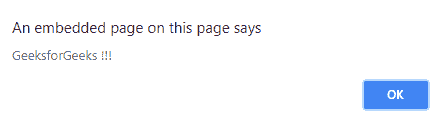

# jQuery | data()带示例

> 原文:[https://www.geeksforgeeks.org/jquery-data-with-examples/](https://www.geeksforgeeks.org/jquery-data-with-examples/)

**数据()**是 jQuery 中的一个内置方法，用于附加数据或获取所选元素的数据。
**语法:**

```html
$(selector).data(para1);
```

**参数:**它接受一个可选参数“para1”，该参数指定要为所选元素检索的数据的名称。
**返回值:**返回所选元素的检索数据。
**jQuery 代码显示数据的工作方式()方法:**
**代码#1:**
在下面的代码中，数据被附加到所选元素。

## 超文本标记语言

```html
<html>

<head>
    <script src="https://ajax.googleapis.com/ajax/libs/
                 jquery/3.3.1/jquery.min.js"></script>
    <style>
        div {
            display: block;
            width: 500px;
            font-size: 37px;
            padding: 50px;
            background-color: lightgrey;
        }

        span {
            color: green;
        }
    </style>
</head>

<body>
    <div>
        Welcome to
        <span></span>for<span></span>!
    </div>
    <script>
        <!-- jQuery code to perform data method -->
        $("div").data("test", {
            first: "Geeks",
            last: "Geeks !"
        });
        $("span:first").text($("div").data("test").first);
        $("span:last").text($("div").data("test").last);
    </script>
</body>

</html>
```

**输出:**


**代码#2:**
在下面的代码中，使用按钮从“div”元素中附加和检索数据。

## 超文本标记语言

```html
<html>

<head>
    <script src="https://ajax.googleapis.com/ajax/libs/
                 jquery/3.3.1/jquery.min.js"></script>
    <script>
        $(document).ready(function() {
        <!--Here data is attaching to the div element -->
            $("#b1").click(function() {
                $("div").data("g", "GeeksforGeeks !!!");
            });
        <!-- Here data is retrieving from the div element -->
            $("#b2").click(function() {
                alert($("div").data("g"));
            });
        });
    </script>
    <style>
        #b1,
        #b2 {
            padding: 10px;
            margin: 5px;
        }
    </style>
</head>

<body>
<!-- This button will attach data to the div element -->
    <button id="b1">This will attach data to div
                       element</button>
    <br>
<!-- This button retrieve the attached data
            from the div element -->
    <button id="b2">This will retrieve the attached data
                     to div element</button>
    <div></div>
</body>

</html>
```

**输出:**
刚刚点击运行按钮-


点击“这将检索附加到 div 元素的数据”按钮后，点击“这将附加到 div 元素的数据”按钮-



点击“这将检索附加到 div 元素的数据”按钮后，无需点击“这将附加到 div 元素的数据”按钮-

