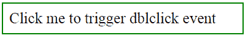
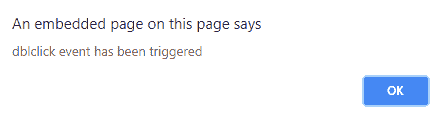
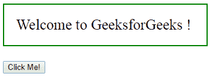
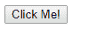

# jQuery | dblclick()带示例

> 原文:[https://www . geesforgeks . org/jquery-dblclick-with-examples/](https://www.geeksforgeeks.org/jquery-dblclick-with-examples/)

**dblclick()** 是 jQuery 中的一个内置方法，用于**触发双击事件**发生。当双击选定的元素时，会出现此方法。
**语法:**

```html
$(selector).dblclick(args);

```

这里的“选择器”是被选择的元素。
**参数:**它接受一个可选参数“args”，指定双击后执行特定任务的函数。
**返回值:**双击选中元素时返回某个函数。

<center>**jQuery code to show the working of dblclick() method:**</center>

**Code #1:**
In the below code, no function is passed to this method.

```html
<html>

<head>
    <script src="https://ajax.googleapis.com/ajax/libs/
                  jquery/3.3.1/jquery.min.js"></script>
    <script>
        <!-- jQuery code to show dbclick method -->
        $(document).ready(function() {
                    $("div").click(function() {
                        $("div").dblclick();
                    });
    </script>
    <style>
        div {
            display: block;
            width: 370px;
            padding: 10px;
            font-size: 25px;
            border: 2px solid green;
        }
    </style>
</head>

<body>
    <!-- click on this div and a pop will appear -->
    <div ondblclick="alert('dblclick event has been triggered')
                 ">Click me to trigger dblclick event</div>
</body>

</html>
```

**输出:**
双击“点击我触发 dblclick 事件”按钮-

双击“点击我触发 dblclick 事件”按钮-


**代码#2:**
在下面的代码中，函数被传递给 dblclick()方法。

```html
<html>

<head>
    <script src="https://ajax.googleapis.com/ajax/libs/
    jquery/3.3.1/jquery.min.js"></script>
    <script>
        <!-- jQuery code to show dbclick method -->
        $(document).ready(function() {
            $("button").dblclick(function() {
                $("p").fadeOut();
            });
        });
    </script>
    <style>
        p {
            display: block;
            padding: 20px;
            color: gree;
            width: 300px;
            border: 2px solid green;
            font-size: 25px;
        }
    </style>
</head>

<body>
    <p>Welcome to GeeksforGeeks !</p>
    <!-- click on this button and above paragraph 
            will disappear -->
    <button> Click Me! </button>
</body>

</html>
```

**输出:**
双击【点击我】按钮前-


双击【点击我】按钮后-
