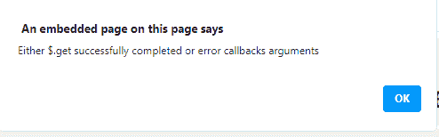

# jQuery delivered . always()方法

> 原文:[https://www . geesforgeks . org/jquery-delivered-always-method/](https://www.geeksforgeeks.org/jquery-deferred-always-method/)

jQuery 中的这个**delivered . always()**方法用于添加处理程序，当 delivered 对象被解析或被拒绝时，将调用这些处理程序。指定的参数可以是单个函数或函数数组。

**语法:**

```html
deferred.always( alwaysCallbacks [, alwaysCallbacks] )
```

**参数:**该方法接受两个参数，如上所述，如下所述:

*   **alwaysCallbacks:** 此参数指定一个函数或函数数组，当延迟的被解析或拒绝时调用。
*   **alwaysCallbacks:** 此参数指定了多个函数或函数数组，当延迟的被解析或拒绝时调用。这是一个可选参数。

**返回值:**该方法返回延迟对象。

**例 1:**

```html
<!DOCTYPE HTML>
<html>

<head>
    <title>
        JQuery deferred.always() method
    </title>

    <script src=
"https://code.jquery.com/jquery-3.5.0.js">
    </script>
</head>

<body style="text-align:center;">
    <h1 style="color:green;">
        GeeksForGeeks
    </h1>

    <p id="GFG_UP"></p>

    <button onclick="Geeks();">
        click here
    </button>

    <script>
        var el_up =
            document.getElementById("GFG_UP");

        el_up.innerHTML =
            "JQuery | deferred.always() method";

        function Geeks() {

            // Use the always() method to
            // alert the user
            $.get("testingGFG.php")
                    .always(function () {
                alert("Either $.get successfully"
                    + " completed or error "
                    + "callbacks arguments");
            });
        } 
    </script>
</body>

</html>
```

**输出:**

*   **点击按钮前:**
    
*   **点击按钮后:**
    

**例 2:**

```html
<!DOCTYPE HTML>
<html>

<head>
    <title>
        JQuery | deferred.always() method
    </title>

    <script src=
"https://code.jquery.com/jquery-3.5.0.js">
    </script>
</head>

<body style="text-align:center;">
    <h1 style="color:green;">
        GeeksForGeeks
    </h1>

    <p id="GFG_UP"></p>

    <button onclick="Geeks();">
        click here
    </button>

    <p id="GFG_DOWN"></p>

    <script>
        var el_up =
            document.getElementById("GFG_UP");
        var el_down =
            document.getElementById("GFG_DOWN");
        el_up.innerHTML =
            "JQuery | deferred.always() method";

        function Geeks() {

            // Use the always() method to
            // change the text
            $.get("testingGFG.php").always(function () {
                el_down.innerHTML = "Either $.get "
                    + "successfully completed" +
                    " or error callbacks arguments";
            });
        } 
    </script>
</body>

</html>
```

**输出:**

