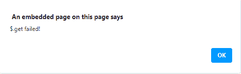

# jQuery delivered . catch()方法

> 原文:[https://www.geeksforgeeks.org/jquery-deferred-catch-method/](https://www.geeksforgeeks.org/jquery-deferred-catch-method/)

jQuery 中的**delivered . catch()**方法用于添加当延迟对象被拒绝时要调用的处理程序。

**语法:**

```html
deferred.catch(failedFilter)

```

**参数:**

*   **failedFilter:** 此参数指定了当延迟对象被拒绝时要调用的函数。

**返回值:**该方法返回延迟对象。

**例 1:**

```html
<!DOCTYPE HTML>
<html>

<head>
    <script src=
"https://code.jquery.com/jquery-3.5.0.js">
    </script>
</head>

<body style="text-align:center;">
    <h1 style="color:green;">
        GeeksForGeeks
    </h1>

    <p>
        JQuery | deferred.catch() method
    </p>

    <button onclick="Geeks();">
        click here
    </button>

    <script>
        function Geeks() {
            $.get("testingGFG.php")
                .then(function () {
                    alert(
            "$.get successfully completed!");
                })
                .catch(function () {
                    alert("$.get failed!");
                });
        } 
    </script>
</body>

</html>
```

**输出:**
**点击按钮前:**

**点击按钮后:**


**例 2:**

```html
<!DOCTYPE HTML>
<html>

<head>
    <script src=
"https://code.jquery.com/jquery-3.5.0.js">
    </script>
</head>

<body style="text-align:center;">
    <h1 style="color:green;">
        GeeksForGeeks
    </h1>

    <p>
        JQuery | deferred.catch() method
    </p>

    <button onclick="Geeks();">
        click here
    </button>

    <p id="GFG_DOWN"></p>

    <script>
        var el_down = document
                .getElementById("GFG_DOWN");
        function Geeks() {
            $.get("testingGFG.php")
                .then(function () {
                    el_down.innerHTML = 
                        "$.get successfully completed";
                })
                .catch(function () {
                    el_down.innerHTML = "$.get failed!";
                });
        } 
    </script>
</body>

</html> 
```

**输出:**
