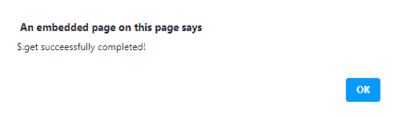

# jQuery delivered . done()方法

> 原文:[https://www.geeksforgeeks.org/jquery-deferred-done-method/](https://www.geeksforgeeks.org/jquery-deferred-done-method/)

jQuery 中的这个**delivered . done()**方法是用来添加处理程序的，当延迟对象被解析时，就会调用这些处理程序。

**语法:**

```html
deferred.done(Callbacks [, Callbacks])
```

**参数:**

*   **回调:**此参数指定一个函数或函数数组，在解析“延迟”时调用。
*   **回调:**该参数指定了一个可选的附加函数或函数数组，在解析延迟时调用。

**返回值:**该方法返回延迟对象。

**例 1:**

## 超文本标记语言

```html
<!DOCTYPE HTML>
<html>

<head>
    <script src=
"https://code.jquery.com/jquery-3.5.0.js">
    </script>
</head>

<body style="text-align:center;">
    <h1 style="color:green;">
        GeeksForGeeks
    </h1>

<p>
        JQuery | deferred.done() method
    </p>

    <button onclick="Geeks();">
        click here
    </button>

    <script>
        function Geeks() {
            $.get("testingGFG.php").done(function () {
                alert("$.get successfully completed!");
            });
        }
    </script>
</body>

</html>
```

**输出:**

**点击按钮前:**


**点击按钮后:**



**例 2:**

## 超文本标记语言

```html
<!DOCTYPE HTML>
<html>

<head>
    <script src=
"https://code.jquery.com/jquery-3.5.0.js">
    </script>
</head>

<body style="text-align:center;">
    <h1 style="color:green;">
        GeeksForGeeks
    </h1>

<p>
        JQuery | deferred.done() method
    </p>

    <button onclick="Geeks();">
        click here
    </button>

    <p id="GFG_DOWN"></p>

    <script>
        var el_down = document
                .getElementById("GFG_DOWN");
        function Geeks() {
            $.get("testingGFG.php")
                    .done(function () {
                el_down.innerHTML =
                "$.get successfully completed";
            });
        }
    </script>
</body>

</html>
```

**输出:**

