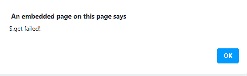

# jQuery delivered . fail()方法

> 原文:[https://www.geeksforgeeks.org/jquery-deferred-fail-method/](https://www.geeksforgeeks.org/jquery-deferred-fail-method/)

jQuery 中的**delivered . fail()**方法用于添加当 delivered 对象被拒绝时要调用的处理程序。此方法接受一个或多个参数，这些参数可以是函数或函数数组。回调的执行顺序与它们被添加的顺序相同。当延迟对象被拒绝时，调用失败的回调。

**语法:**

```html
deferred.fail(failedCallbacks, failedCallbacks )
```

**参数:**

*   **failed 回调:**此参数指定一个函数或函数数组，当“延迟”被拒绝时将调用这些函数。
*   **failed 回调:**此参数指定可选的附加函数，或函数数组，当延迟被拒绝时将调用这些函数。

**返回值:**该方法返回延迟对象。

**例 1:**

## 超文本标记语言

```html
<!DOCTYPE HTML>
<html>

<head>
    <script src=
"https://code.jquery.com/jquery-3.5.0.js">
    </script>
</head>

<body style="text-align:center;">
    <h1 style="color:green;">
        GeeksForGeeks
    </h1>

    <p>
        JQuery | deferred.fail() method
    </p>

    <button onclick="Geeks();">
        click here
    </button>

    <script>
        function Geeks() {
            $.get("testingGFG.php")
                .done(function () {
                    alert("$.get successfully completed!");
                })
                .fail(function () {
                    alert("$.get failed!");
                });
        } 
    </script>
</body>

</html>
```

**Output:**

**点击按钮前:**


**点击按钮后:**



**例 2:**

## 超文本标记语言

```html
<!DOCTYPE HTML>
<html>

<head>
    <script src=
"https://code.jquery.com/jquery-3.5.0.js">
    </script>
</head>

<body style="text-align:center;">
    <h1 style="color:green;">
        GeeksForGeeks
    </h1>

    <p>
        JQuery | deferred.fail() method
    </p>

    <button onclick="Geeks();">
        click here
    </button>

    <p id="GFG_DOWN"></p>

    <script>
        var el_down = document.getElementById("GFG_DOWN");
        function Geeks() {
            $.get("testingGFG.php")
                .done(function () {
                    el_down.innerHTML = 
                        "$.get successfully completed";
                })
                .fail(function () {
                    el_down.innerHTML = "$.get failed!";
                });
        } 
    </script>
</body>

</html>
```

**输出:**

