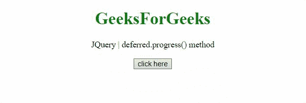

# jQuery 延期进度()方法

> 原文:[https://www . geesforgeks . org/jquery-延期-进度-方法/](https://www.geeksforgeeks.org/jquery-deferred-progress-method/)

jQuery 中的这个**delivered . progress()**方法用于添加当 delivered 对象生成进度通知时要调用的处理程序。

**语法:**

```
deferred.progress(progressCallbacks[, progressCallbacks])
```

**参数:**

*   【progress 回调:该参数是一个函数或函数数组，当延迟器生成进度通知时调用。
*   【progress 回调:它是一个可选参数，是一个函数或函数数组，当 delivered 生成进度通知时调用。

**返回值:**该方法返回延迟对象。

**示例 1:** 在本例中，progress()方法是用 reject()方法调用的。

## 超文本标记语言

```
<!DOCTYPE HTML>
<html>

<head>
    <script src=
"https://code.jquery.com/jquery-3.5.0.js">
    </script>
</head>

<body style="text-align:center;">

    <h1 style="color:green;">
        GeeksForGeeks
    </h1>

    <p>
        JQuery | deferred.progress() method
    </p>

    <button onclick="Geeks();">
        click here
    </button>

    <p id="GFG"></p>

    <script>
        function Func(val, div) {
            $(div).append(val);
        }
        function Geeks() {
            var def = $.Deferred();
            def.fail(Func);
            def.progress(Func);
            def.reject('"Func" is added as '
                + 'progressCallbacks using '
                + 'progress() method when '
                + 'Deferred object is rejected',
                  '#GFG')
        } 
    </script>
</body>

</html>
```

**输出:**


**示例 2:** 在本例中，使用 resolve()方法调用 progress()方法。

## 超文本标记语言

```
<!DOCTYPE HTML>
<html>

<head>
    <script src=
"https://code.jquery.com/jquery-3.5.0.js">
    </script>
</head>

<body style="text-align:center;">
    <h1 style="color:green;">
        GeeksForGeeks
    </h1>

    <p>
        JQuery | deferred.progress() method
    </p>

    <button onclick="Geeks();">
        click here
    </button>

    <p id="GFG"></p>

    <script>
        function Func(val, div) {
            $(div).append(val);
        }
        function Geeks() {
            var def = $.Deferred();
            def.done(Func);
            def.progress(Func);
            def.resolve('"Func" is added as '
                + 'progressCallbacks using '
                + 'progress() method when '
                + 'Deferred object is resolved',
                  '#GFG')
        } 
    </script>
</body>

</html>
```

**输出:**

