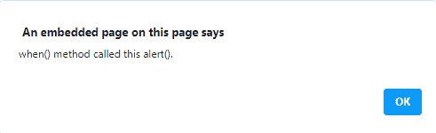
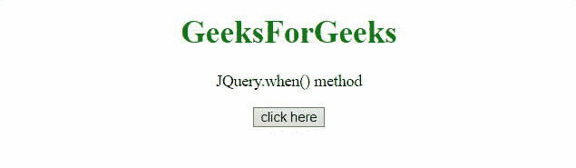

# jQuery 延期。承诺()方法

> 原文:[https://www . geesforgeks . org/jquery-延期-承诺-方法/](https://www.geeksforgeeks.org/jquery-deferred-promise-method/)

这个**。JQuery 中的 promise()方法**返回一个 Promise 对象，当绑定到集合的某些类型操作结束时，无论是否排队，都要观察这个对象。

**语法:**

```
.promise([type][, target])
```

**参数:**

*   **类型**:该参数指定需要观察的队列类型。
*   **目标**:该参数指定需要附加承诺方法的对象。

**返回值**:这个方法返回一个动态生成的 Promise，一旦绑定到集合的动作完成，不管是否排队，这个 Promise 就会被解析。

下面讨论两个例子:

*   **Example**: In this example, the Deferred() is used to create a new object and after that then() method is called with notify and resolve method.

    ```
    <!DOCTYPE HTML> 
    <html>  
    <head>
        <title> 
          JQuery.when() method
        </title>
        <script src="https://code.jquery.com/jquery-3.5.0.js">
      </script> 
    </head>   
    <body style="text-align:center;">
        <h1 style="color:green">  
            GeeksForGeeks  
        </h1> 
        <p id="GFG_UP"> 
        </p>
        <button onclick = "Geeks();">
        click here
        </button>
        <p id="GFG_DOWN"> 
        </p>
        <script> 
            var el_up = document.getElementById("GFG_UP");
            el_up.innerHTML = "JQuery.when() method";
            var def = $.Deferred();
            function Geeks() {
                $.when().then(function(a) {
                  alert( "when() method called this alert()." );
                });
            } 
         </script> 
    </body>   
    </html>        
    ```

    **输出** :
    **点击按钮前:**
    

    **点击按钮后:**

    

    *   **Example**: In this example, the Deferred() method is used and the state of Deferred object is checked.

        ```
        <!DOCTYPE HTML> 
        <html>  
        <head>
            <title> 
              JQuery.when() method
            </title>
             <script src="https://code.jquery.com/jquery-3.5.0.js">
        </script> 
        </head>   
        <body style="text-align:center;">
            <h1 style="color:green">  
                GeeksForGeeks  
            </h1> 
            <p id="GFG_UP"> 
            </p>
            <button onclick = "Geeks();">
            click here
            </button>
            <p id="GFG_DOWN"> 
            </p>
            <script>
                var el_up = document.getElementById("GFG_UP");
                el_up.innerHTML = "JQuery.when() method";
                var def = $.Deferred();
                function Geeks() {
                    $.when(def).done(function (x) {
                      $('#GFG_DOWN').append('when() method is executed.')
                    });
                    def.resolve();
                } 
             </script> 
        </body>   
        </html>              
        ```

        **输出:**
        