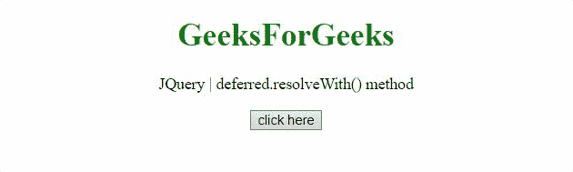

# JQuery delivered . resolvewith()方法

> 原文:[https://www . geesforgeks . org/jquery-delivered-resolvewith-method/](https://www.geeksforgeeks.org/jquery-deferred-resolvewith-method/)

JQuery 中的这个**delivered . resolvewith()**方法用于解析一个 delivered 对象，并调用 done 回调以及给定的上下文和参数。
**语法:**

```html
deferred.resolveWith(context[, args])

```

**参数:**

*   **上下文:**这个参数是作为‘This’对象传递给 done 回调的上下文。
*   **参数:**这个参数是一个可选的参数数组，它被传递给 done 回调。

**返回值:**此方法方法返回延迟对象。

下面讨论两个例子:

*   **示例:**在本例中，我们使用两个参数解析延迟对象，并处理任何 done 回调。

    ```html
    <!DOCTYPE HTML> 
    <html>  
    <head> 
        <title> 
          JQuery | deferred.resolveWith() method
        </title>
        <script src="https://code.jquery.com/jquery-3.5.0.js">
        </script> 
    </head>   
    <body style="text-align:center;">
        <h1 style="color:green;">  
            GeeksForGeeks  
        </h1> 
        <p id="GFG_UP"> 
        </p>
        <button onclick = "Geeks();">
        click here
        </button>
        <p id="GFG_DOWN"> 
        </p>
        <script> 
          var el_up = document.getElementById("GFG_UP");
          el_up.innerHTML = "JQuery | deferred.resolveWith() method";
          function Func(val, div){
            $(div).append(val);
          }
            function Geeks() {
                var def = $.Deferred();
                def.done(Func);
                def.resolveWith(
    this, ['Deferred is resolved by resolveWith() method.
                   <br />', '#GFG_DOWN']);
            } 
        </script> 
    </body>   
    </html>       
    ```

*   **输出:**
    

*   **示例:**在本例中，我们仅使用一个参数解析延迟对象，并处理任何 one 回调。

    ```html
    <!DOCTYPE HTML> 
    <html>  
    <head> 
        <title> 
          JQuery | deferred.resolveWith() method
        </title>
        <script src="https://code.jquery.com/jquery-3.5.0.js">
        </script> 
    </head>   
    <body style="text-align:center;">
        <h1 style="color:green;">  
            GeeksForGeeks  
        </h1> 
        <p id="GFG_UP"> 
        </p>
        <button onclick = "Geeks();">
        click here
        </button>
        <p id="GFG_DOWN"> 
        </p>
        <script> 
            var el_up = document.getElementById("GFG_UP");
            el_up.innerHTML = 
                 "JQuery | deferred.resolveWith() method";
            function Func(div){
              $(div).append(
                  'Deferred is resolved by resolveWith() method');
            }
            function Geeks() {
                var def = $.Deferred();
                def.done(Func);
                def.resolveWith(this, ['#GFG_DOWN']);
            } 
        </script> 
    </body>   
    </html>
    ```

*   **输出:**
    