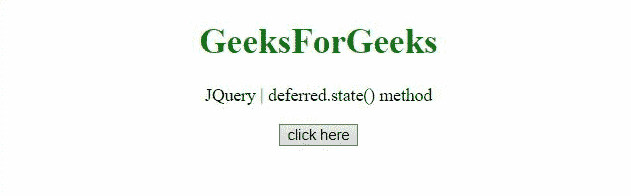
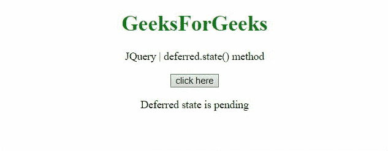

# JQuery delivered . state()方法

> 原文:[https://www.geeksforgeeks.org/jquery-deferred-state-method/](https://www.geeksforgeeks.org/jquery-deferred-state-method/)

JQuery 中的这个**delivered . state()**方法用来确定一个 delivered 对象的当前状态。
**语法:**

```
deferred.state()

```

**返回值:**该方法返回延迟对象的状态。

下面讨论两个例子:

*   **示例:**在此示例中，延迟对象“def”的状态为待定。

    ```
    <!DOCTYPE HTML> 
    <html>  
    <head> 
        <title> 
          JQuery | deferred.state() method
        </title>
        <script src="https://code.jquery.com/jquery-3.5.0.js">
    </script> 
    </head>   
    <body style="text-align:center;">
        <h1 style="color:green;">  
            GeeksForGeeks  
        </h1> 
        <p id="GFG_UP"> 
        </p>
        <button onclick = "Geeks();">
        click here
        </button>
        <p id="GFG_DOWN"> 
        </p>
        <script> 
            var el_up = document.getElementById("GFG_UP");
            el_up.innerHTML = "JQuery | deferred.state() method";
            var def = $.Deferred();
            function Geeks() {
             $('#GFG_DOWN').text('deferred state is ' + def.state());
            } 
        </script> 
    </body>   
    </html>
    ```

*   **输出:**
    

*   **示例:**在本例中，延迟对象“def”的状态为待定，通过单击按钮，状态变为已解决。

    ```
    <!DOCTYPE HTML> 
    <html>  
    <head> 
        <title> 
          JQuery | deferred.state() method
        </title>
        <script src="https://code.jquery.com/jquery-3.5.0.js">
    </script> 
    </head>   
    <body style="text-align:center;">
        <h1 style="color:green;">  
            GeeksForGeeks  
        </h1> 
        <p id="GFG_UP"> 
        </p>
        <button onclick = "Geeks();">
        click here
        </button>
        <p id="GFG_DOWN"> 
        </p>
        <script> 
            var el_up = document.getElementById("GFG_UP");
            el_up.innerHTML = "JQuery | deferred.state() method";
            var def = $.Deferred();
            def.always(Func);
            $('#GFG_DOWN').append(
              'Deferred state is ' + def.state() + '</br>');
            function Func(val, div){
              $(div).append(val);
            }
            function Geeks() {
                def.resolve(
          'Our deferred is resolved now. <br />', '#GFG_DOWN');
                $('#GFG_DOWN').append( 
    'Current state of deferred is ' + def.state() + ' <br />');
            } 
        </script> 
    </body>   
    </html>
    ```

*   **输出:**
    