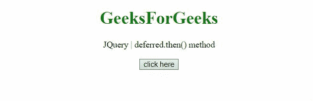
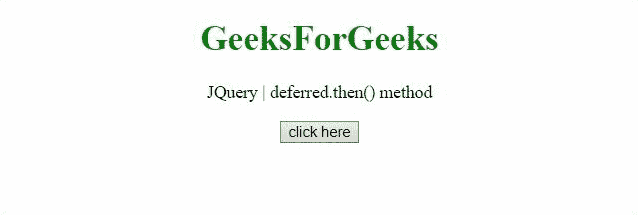

# JQuery delivered . then()方法

> 原文:[https://www.geeksforgeeks.org/jquery-deferred-then-method/](https://www.geeksforgeeks.org/jquery-deferred-then-method/)

JQuery 中的这个**delivered . then()**方法用于添加处理程序，当 delivered 对象被解析、拒绝或正在进行时，将调用这些处理程序。

**语法:**

```html
deferred.then(doneCallbacks[, failCallbacks][, progressCallbacks])

```

**参数:**

*   **doneCallbacks:** 这是一个函数，或者函数数组，在解析 delivered 时调用。
*   **failbacks:**这是一个函数，或者函数数组，当 delivered 被拒绝时调用。
*   【progress 回调:这是一个函数或函数数组，当进度通知被发送到 delivered 对象时调用。

**返回值:**此方法方法返回延迟对象。

下面讨论两个例子:

*   **示例:**在本例中，使用 notify 和 resolve 方法调用了 then()方法。

    ```html
    <!DOCTYPE HTML> 
    <html>  
    <head> 
        <title> 
          JQuery | deferred.then() method
        </title>
        <script src="https://code.jquery.com/jquery-3.5.0.js">
    </script> 
    </head>   
    <body style="text-align:center;">
        <h1 style="color:green;">  
            GeeksForGeeks  
        </h1> 
        <p id="GFG_UP"> 
        </p>
        <button onclick = "Geeks();">
        click here
        </button>
        <p id="GFG_DOWN"> 
        </p>
        <script> 
            var el_up = document.getElementById("GFG_UP");
            el_up.innerHTML = "JQuery | deferred.then() method";
            function Func1(val, div){
              $(div).append("From doneCallbacks - " + val);
            }
            function Func2(val, div){
              $(div).append("From failCallbacks - " + val);
            }
            function Func3(val, div){
              $(div).append("From progressCallbacks - " + val);
            }
            function Geeks() {
                var def = $.Deferred();
                def.then(Func1, Func2, Func3);
                def.notify('Deferred "def" is notified.<br/>'
                         , '#GFG_DOWN');
                def.resolve('Deferred "def" is resolved.<br/>'
                         , '#GFG_DOWN');
            } 
        </script> 
    </body>   
    </html>      

    ```

*   **输出:**
    

*   **示例:**在本例中，使用 notify 和 reject 方法调用了 then()方法。

    ```html
    <!DOCTYPE HTML> 
    <html>  
    <head> 
        <title> 
          JQuery | deferred.then() method
        </title>
        <script src="https://code.jquery.com/jquery-3.5.0.js">
        </script> 
    </head>   
    <body style="text-align:center;">
        <h1 style="color:green;">  
            GeeksForGeeks  
        </h1> 
        <p id="GFG_UP"> 
        </p>
        <button onclick = "Geeks();">
        click here
        </button>
        <p id="GFG_DOWN"> 
        </p>
        <script> 
            var el_up = document.getElementById("GFG_UP");
            el_up.innerHTML = "JQuery | deferred.then() method";
            function Func1(val, div){
              $(div).append("From doneCallbacks - " + val);
            }
            function Func2(val, div){
              $(div).append("From failCallbacks - " + val);
            }
            function Func3(val, div){
              $(div).append("From progressCallbacks - " + val);
            }
            function Geeks() {
                var def = $.Deferred();
                def.then(Func1, Func2, Func3);
                def.notify('Deferred "def" is notified.<br/>',
                           '#GFG_DOWN');
                def.reject('Deferred "def" is rejected.<br/>',
                           '#GFG_DOWN');
            } 
        </script> 
    </body>   
    </html> 
    ```

*   **输出:**
    