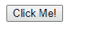
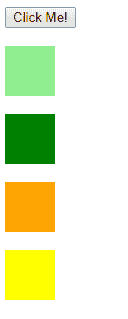
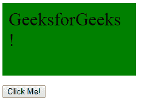
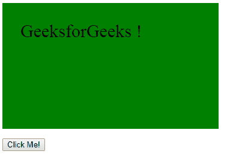

# jQuery | delay()带示例

> 原文:[https://www.geeksforgeeks.org/jquery-delay-with-examples/](https://www.geeksforgeeks.org/jquery-delay-with-examples/)

**延迟()**是 jQuery 中的一个内置方法，用于设置一个定时器来延迟队列中下一个项目的执行。
**语法:**

```
$(selector).delay(para1, para2);

```

**参数:**接受以下指定的两个参数-

*   **para1:** 指定延迟的速度。
*   **para2:** 可选，指定队列名称。

**返回值:**以指定速度返回所选元素。

<center>**jQuery code to show the working of delay() method:**</center>

**Code #1:**
In the below code, timer is set to all the block.

```
<html>

<head>
    <script src="https://ajax.googleapis.com/ajax/libs/
                jquery/3.3.1/jquery.min.js"></script>
    <script>
        <!-- jquery code to demonstrate delay method -->
        $(document).ready(function() {
            $("button").click(function() {
                $("#d1").delay("slow").fadeIn();
                $("#d2").delay("fast").fadeIn();
                $("#d3").delay(1000).fadeIn();
                $("#d4").delay(4000).fadeIn();
            });
        });
    </script>
</head>

<body>
    <!-- click on this button -->
    <button>Click Me!</button>
    <br>
    <br>
    <div id="d1" style="width:50px;height:50px;display:
                 none;background-color:lightgreen;"></div>
    <br>
    <div id="d2" style="width:50px;height:50px;display:
                 none;background-color:green;"></div>
    <br>
    <div id="d3" style="width:50px;height:50px;display:
                 none;background-color:orange;"></div>
    <br>
    <div id="d4" style="width:50px;height:50px;display:
                 none;background-color:yellow;"></div>
    <br>
</body>

</html>
```

**输出:**
点击【点击我】按钮前-
点击【点击我】按钮后-


**代码#2:**
在下面的代码中，已经展示了如何使用这种方法延迟动画。

```
<html>

<head>
    <script src="https://ajax.googleapis.com/ajax/libs/
                jquery/3.3.1/jquery.min.js"></script>
    <script>
        $(document).ready(function() {
        <!-- jQuery code to show the working of delay method -->
            $("#btn1").click(function() {
                $("div").animate({
                    height: "150px"
                });
                $("div").animate({
                    width: "150px"
                });
                $("div").delay(1200).animate({
                    width: "300px",
                    padding: "30px"
                });
            });
        });
    </script>
    <style>
        #d {
            display: block;
            width: 200px;
            height: 100px;
            background-color: green;
            font-size: 30px;
            padding: 10px;
        }
    </style>
</head>

<body>
    <div id="d">GeeksforGeeks !</div>
<!--click on this button to show the effect of delay method -->
    <p>
        <button id="btn1">Click Me!</button>
    </p>
</body>

</html>
```

**输出:**
点击【点击我】按钮前-
点击【点击我】按钮后-
