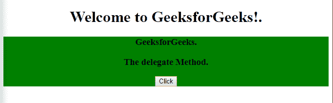

# jQuery |委托()方法

> 原文:[https://www.geeksforgeeks.org/jquery-delegate-method/](https://www.geeksforgeeks.org/jquery-delegate-method/)

jQuery 中的**委托()方法**用于向指定的元素添加一个或多个事件处理程序，这些事件处理程序是所选元素的子元素，也用于指定每当事件发生时运行的函数。

**语法**

```html
$(selector).delegate( childSelector, event, data, function )
```

**参数:**该方法接受四个参数，如上所述，如下所述:

*   **childSelector:** 为必选项，用于指定一个或多个附加到事件处理程序的子元素。
*   **事件:**为必选项，用于指定附加到元素的一个或多个事件。多个事件值由空格分隔，并且必须是有效的事件。
*   **数据:**为可选参数，用于指定传递给函数的附加数据。
*   **功能:**为必选项，用于指定事件发生时要运行的功能。

**例 1:**

```html
<!DOCTYPE html> 
<html> 
    <head> 
        <title>
            delegate() Method in jQuery
        </title> 

        <script src=
"https://ajax.googleapis.com/ajax/libs/jquery/3.3.1/jquery.min.js">
        </script>

        <!-- jQuery script to add events -->
        <script>
            $(document).ready(function() {
                $("div").delegate("h3", "click", function() {
                    $("h3").css("background-color", "green");
                });
            });
        </script>
    </head>

    <body> 
        <center>
            <h1>Welcome to GeeksforGeeks!</h1> 

            <p>
                Click on the below element (lightgreen
                background) to change background-color
            </p>

            <div style="background-color:lightgreen;">
                <h3>GeeksForGeeks</h3>
            </div>

            <h3>GeeksForGeeks.</h3>
      </center>
    </body> 
</html>   
```

**输出:**
**前点击元素:**

**后点击元素:**


**例 2:**

```html
<!DOCTYPE html> 
<html> 
    <head> 
        <title>
            delegate() Method in jQuery
        </title> 

        <script src=
"https://ajax.googleapis.com/ajax/libs/jquery/3.3.1/jquery.min.js">
        </script>

        <!-- jQuery script for delegate() method -->
        <script>
            $(document).ready(function(){
                $("div").delegate("h3", "click", function(){
                    $(this).slideToggle();
                });

                $("button").click(function(){
                    $("<h3>This show how the delegate Method" 
                    + " works .</h3>").insertAfter("button");
                });
            });
        </script>
    </head> 

    <body> 
        <center>
            <h1>Welcome to GeeksforGeeks!.</h1> 

          <div style="background-color:green">

              <h3>GeeksforGeeks.</h3>
              <h3>The delegate Method.</h3>

              <button>Click</button>
          </div>
      </center>
    </body> 
</html>   
```

**输出:**
**点击按钮前:**

**点击按钮后:**
