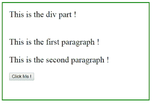
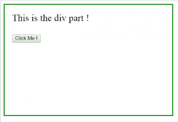

# jQuery | detach()示例

> 原文:[https://www.geeksforgeeks.org/jquery-detach-with-examples/](https://www.geeksforgeeks.org/jquery-detach-with-examples/)

**分离()**是 jQuery 中的一个内置方法，它从 DOM 树中移除选定的元素，包括其所有文本和子节点，但保留数据和事件。文档对象模型是一个万维网联盟标准。这定义了访问 DOM 树中的元素。
**语法:**

```
$(selector).detach()

```

**参数:**不接受任何参数。
**返回值:**返回已删除所有文本和子节点的选中元素。

<center>**jQuery code to show the working of this method:**</center>

**Code #1:**
In the below code, all the paragraph element will detached.

```
<html>

<head>
    <script src="https://ajax.googleapis.com/ajax/libs/jquery/3.3.1/jquery.min.js">
    </script>
    <script>
        <!-- jQuery code to show detach method working -->
        $(document).ready(function() {
            $("button").click(function() {
                $("p").detach();
            });
        });
    </script>
    <style>
        body {
            display: block;
            width: 400px;
            height: 250px;
            padding: 20px;
            border: 2px solid green;
            font-size: 25px;
        }
    </style>
</head>

<body>
    <div> This is the div part !</div>
    <br>
    <!-- This paragraphs get detached -->
    <p>This is the first paragraph !</p>
    <p>This is the second paragraph !</p>
    <button>Click Me !</button>
</body>

</html>
```

**输出:**
点击【点击我】按钮前-
点击【点击我】按钮后-
