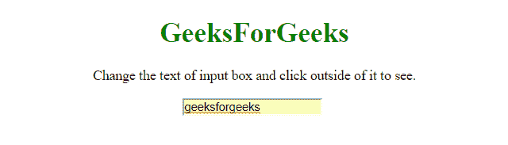
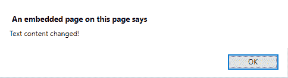

# JQuery |检测文本框内容是否更改

> 原文:[https://www . geesforgeks . org/jquery-detect-a-textbox-content-is-changed-or-not/](https://www.geeksforgeeks.org/jquery-detect-a-textbox-content-is-changed-or-not/)

为了检测输入的文本内容是否改变，我们使用**。JQuery 的 on()** 方法。
**。on()**
这是 jQuery 提供的内置方法，用于为所选元素及其子元素附加事件处理程序。

**语法:**

```html
$(selector).on(event, childSel, data, fun, map)

```

**参数:**

*   **事件:**此参数为必填项。它定义要附加到选定元素的事件或命名空间。如果要提供多个事件，必须用空格隔开。
*   **儿童选择:**该参数为可选参数。它定义事件处理程序应该只附加到已定义的子元素。
*   **数据:**此参数为可选。它指定要传递给函数的附加数据。
*   **乐趣:**此参数可选。它指定在事件发生时运行的函数。
*   **映射:**该参数指定一个事件映射({event: function，event: function，…})，包含一个或多个事件和事件发生时要运行的函数

**示例-1:** 在此示例中，出现警告框，提示**“文本内容已更改！”**当输入的文本发生变化时。

```html
<!DOCTYPE html> 
<html> 

<head> 
    <title> 
        JQuery |  
      detect a textbox's content has changed. 
    </title> 
    <script src= 
"https://ajax.googleapis.com/ajax/libs/jquery/3.4.0/jquery.min.js"> 
    </script> 

</head> 

<body style="text-align:center;" 
      id="body"> 
    <h1 style="color:green;">   
            GeeksForGeeks   
        </h1> 
    <p> 
      Change the text of input text and 
      click outside of it to see. 
    </p> 
    <input id="input"
           name="input"/> 
    <br> 
    <br> 
    <script> 
        $("#input").on("change", function() { 
            alert('Text content changed!'); 
        }); 
    </script> 
</body> 

</html> 
```

**输出:**


*   **在输入框外点击后:**
    

**示例-2:** 在此示例中，出现警告框，提示**“文本内容已更改！”**当任何一种活动发生时。

*   输入的文本已更改。
*   按键事件发生。
*   有东西粘贴到输入框。
*   发生 propertychange。

```html
<!DOCTYPE html> 
<html> 

<head> 
    <title> 
        JQuery | 
      detect a textbox's content has changed. 
    </title> 
    <script src= 
"https://ajax.googleapis.com/ajax/libs/jquery/3.4.0/jquery.min.js"> 
    </script> 

</head> 

<body style="text-align:center;" 
      id="body"> 
    <h1 style="color:green;">   
            GeeksForGeeks   
        </h1> 
    <p>  
      Change the text of input text  
      and click outside of it to see. 
    </p> 
    <input id="input" 
           name="input" /> 
    <br> 
    <br> 
    <script> 
        $("#input").on( 
          "propertychange change keyup paste input", function() { 
            alert('Text content changed!'); 
        }); 
    </script> 
</body> 

</html> 
```

**输出:**


*   **事件发生后:**
    