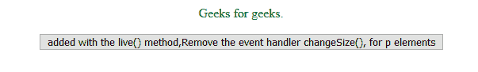
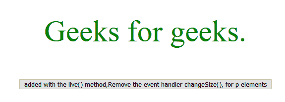
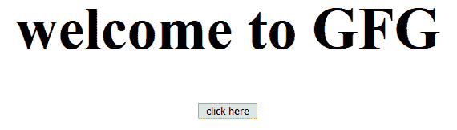

# jQuery | die()方法

> 原文:[https://www.geeksforgeeks.org/jquery-die-method/](https://www.geeksforgeeks.org/jquery-die-method/)

添加了 **live()方法**的 **die()方法**为所选元素移除了一个或多个事件处理程序。

**语法:**

```
$(selector).die(event, function) 
```

**参数:**

*   **事件:**指定一个或多个要移除的事件处理程序。多个有效事件值由空格分隔。
*   **功能:**用于指定要删除的功能。

**示例-1:**

```
<!DOCTYPE html>
<html>

<head>
    <script src=
"https://ajax.googleapis.com/ajax/libs/jquery/1.7/jquery.min.js">
    </script>
    <script>
        function changeSize() {
            $(this).animate({
                fontSize: "+=3px"
            });
        }

        function changeSpacing() {
            $(this).animate({
                letterSpacing: "+=2px"
            });
        }

        $(document).ready(function() {
            $("p").live("click", changeSize);
            $("p").live("click", changeSpacing);
            $("button").click(function() {
                $("p").die("click", changeSize);
            });
        });
    </script>
</head>

<body>

    <center>
        <p style="color:green;">
          Geeks for geeks.
      </p>
        <button>
          added with the live() method, 
          Remove the event handler changeSize(), 
          for p elements
      </button>
    </center>
</body>

</html>
```

**输出:**

**点击前一段:**


**点击后段落:**


**示例-2:**

```
<!DOCTYPE html>
<html>

<head>
    <script src=
"https://ajax.googleapis.com/ajax/libs/jquery/1.7/jquery.min.js">
    </script>
    <script>
        function changeSize() {
            $(this).animate({
                fontSize: "+=3px"
            });
        }

        function changeSpacing() {
            $(this).animate({
                letterSpacing: "+=2px"
            });
        }

        $(document).ready(function() {
            $("h1").live("click", changeSize);
            $("h1").live("click", changeSpacing);
            $("button").click(function() {
                $("h1").die("click", changeSize);
            });
        });
    </script>
</head>

<body>
    <div>
        <center>
            <h1>welcome to GFG</h1>
      </center>
    </div>

    <center>
        <button>click here</button>
    </center>
</body>

</html>
```

**点击前一段:**


**点击后段落:**
