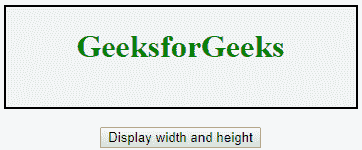
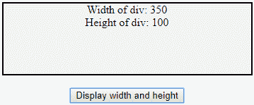
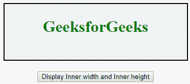
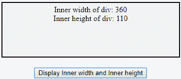
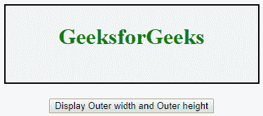
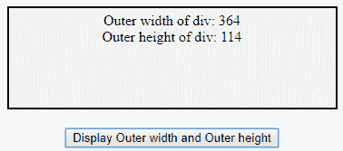

# jQuery | Dimensions

> 哎哎哎:# t0]https://www . geeksforgeeks . org/jquery-dimensions/

**JQuery 维度**是 JQuery 中的一个内置方法，用于处理各种元素和浏览器窗口的维度。JQuery 维度中有几种维度方法。
**jQuery 维度方法:**

*   **width():** 此方法设置或返回元素的宽度，不包括填充、边框和边距。
*   **height():** 此方法设置或返回元素的高度，不包括填充、边框和边距。
*   **innerWidth():** 此方法设置或返回包含填充的元素的内部宽度。
*   **innerHeight():** 此方法设置或返回包含填充的元素的内部高度。
*   **外部宽度():**此方法设置或返回元素的外部宽度，包括填充和边框。
*   **外部高度():**此方法设置或返回元素的外部高度，包括填充和边框。

**注意:**所有方法设置或返回指定的< div >元素。
**JQuery width()和 height()方法:**在这个例子中你会看到在一个指定的< div >元素中该方法会返回元素的宽度和高度。
**例:**

## 超文本标记语言

```html
<!DOCTYPE html>
<html>

<head>
    <title>
        jQuery Dimensions
    </title>

    <script src=
"https://ajax.googleapis.com/ajax/libs/jquery/3.3.1/jquery.min.js">
    </script>

    <script>
        $(document).ready(function() {
            $("button").click(function() {
                var txt = "";
                txt += "Width of div: " + $(".geeks").width() + "</br>";
                txt += "Height of div: " + $(".geeks").height();
                $(".geeks").html(txt);
            });
        });
    </script>

    <style>
        .geeks {
            height: 100px;
            width: 350px;
            padding: 5px;
            margin: 3px;
            border: 2px solid black;
            background-color: #F0F3F4;
        }

        h1 {
            color: green;
        }
    </style>
</head>

<body>
    <center>
        <div class="geeks">
            <h1>GeeksforGeeks</h1></div>
        <br>
        <button>Display width and height </button>
    </center>
</body>

</html>
```

**输出:**

*   **点击按钮前:**



*   **点击按钮后:**



**JQuery innerWidth()和 innerHeight()方法:**在本例中，您将看到在指定的< div >元素中，该方法将返回元素的内部宽度和内部高度。
**例:**

## 超文本标记语言

```html
<!DOCTYPE html>
<html>

<head>
    <title>
        jQuery Dimensions
    </title>

    <script src=
"https://ajax.googleapis.com/ajax/libs/jquery/3.3.1/jquery.min.js">
    </script>

    <script>
        $(document).ready(function() {
            $("button").click(function() {
                var txt = "";
                txt += "Inner width of div: " + $(".geeks").innerWidth() + "</br>";
                txt += "Inner height of div: " + $(".geeks").innerHeight();
                $(".geeks").html(txt);
            });
        });
    </script>

    <style>
        .geeks {
            height: 100px;
            width: 350px;
            padding: 5px;
            margin: 3px;
            border: 2px solid black;
            background-color: #F0F3F4;
        }

        h1 {
            color: green;
        }
    </style>
</head>

<body>
    <center>
        <div class="geeks">
            <h1>GeeksforGeeks</h1></div>
        <br>
        <button>Display Inner width and Inner height </button>
    </center>
</body>

</html>
```

**输出:**

*   **点击按钮前:**



*   **点击按钮后:**



**JQuery outwidth()和 outerHeight()方法:**在本例中，您将看到在指定的< div >元素中，该方法将返回元素的外部宽度和外部高度。
**例:**

## 超文本标记语言

```html
<!DOCTYPE html>
<html>

<head>
    <title>
        jQuery Dimensions
    </title>

    <script src=
"https://ajax.googleapis.com/ajax/libs/jquery/3.3.1/jquery.min.js">
    </script>

    <script>
        $(document).ready(function() {
            $("button").click(function() {
                var txt = "";
                txt += "Outer width of div: " + $(".geeks").outerWidth() + "</br>";
                txt += "Outer height of div: " + $(".geeks").outerHeight();
                $(".geeks").html(txt);
            });
        });
    </script>

    <style>
        .geeks {
            height: 100px;
            width: 350px;
            padding: 5px;
            margin: 3px;
            border: 2px solid black;
            background-color: #F0F3F4;
        }

        h1 {
            color: green;
        }
    </style>
</head>

<body>
    <center>
        <div class="geeks">
            <h1>GeeksforGeeks</h1></div>
        <br>
        <button>Display Outer width and Outer height </button>
    </center>
</body>

</html>
```

**输出:**

*   **点击按钮前:**



*   **点击按钮后:**

