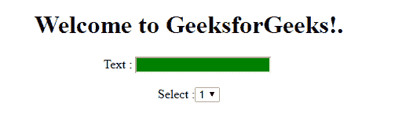

# jQuery |:禁用选择器

> 原文:[https://www.geeksforgeeks.org/jquery-disabled-selector/](https://www.geeksforgeeks.org/jquery-disabled-selector/)

**:禁用选择器**用于选择所有禁用的表单元素。

**语法:**

```
$(":disabled")
```

**参数:**

*   **:禁用选择器:**用于选择支持禁用属性的 HTML 元素。即按钮标签、输入标签、选项组标签、选项标签、选择标签和文本区域标签。

**示例-1:**

```
<!DOCTYPE html>
<html>

<head>
    <title>:disabled Selector</title>
    <script src=
"https://ajax.googleapis.com/ajax/libs/jquery/3.3.1/jquery.min.js">
  </script>

  <script>
        $(document).ready(function() {
            $(":disabled").css(
              "background-color", "green");
        });
    </script>
</head>

<body>
    <center>
        <form action="#">
            <h1>Welcome to GeeksforGeeks!.
          </h1>
            <div>
                Text :
                <input type="text" 
                       name="text" 
                       disabled="disabled">
                <br/>
                <br/> Select :
                <select>
                    <option>1</option>
                    <option>2</option>
                    <option>3</option>
                    <option>4</option>
                </select>
            </div>

        </form>
    </center>

</body>

</html>
```

**输出:**


**示例-2:**

```
<!DOCTYPE html>
<html>

<head>
    <title>:disabled Selector
  </title>
    <script src=
"https://ajax.googleapis.com/ajax/libs/jquery/3.3.1/jquery.min.js">
  </script>

  <script>
        $(document).ready(function() {
            $(":disabled").css(
              "background-color", "green");
        });
    </script>
</head>

<body>
    <center>
        <form action="#">
            <h1>Welcome to GeeksforGeeks!.
          </h1>
            <div>
                Text :
                <input type="text" 
                       name="text" 
                       value="GeeksforGeeks">
                <br/>
                <input type="submit" 
                       name="submit" 
                       value="submit" 
                       disabled="disabled">
            </div>

        </form>
    </center>

</body>

</html>
```

**输出:**
