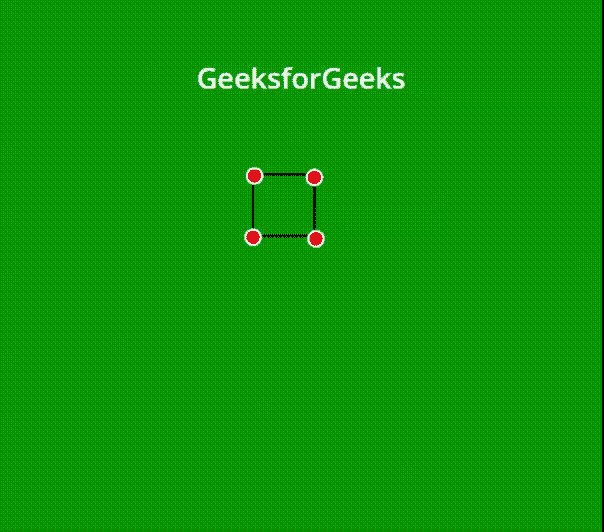
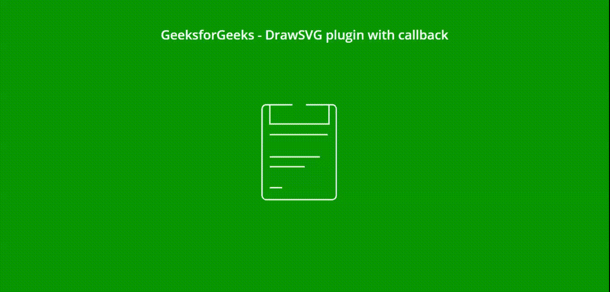
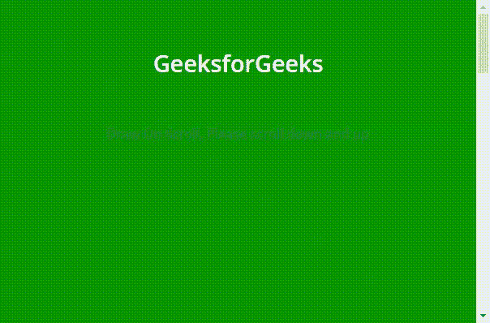

# jQuery | DrawSVG 外挂程式

> 原文:[https://www.geeksforgeeks.org/jquery-drawsvg-plugin/](https://www.geeksforgeeks.org/jquery-drawsvg-plugin/)

[](https://www.geeksforgeeks.org/html-svg-basics/)**或标量矢量图形是基于扩展标记语言的图形，支持增强交互性的二维图像动画。SVG 的规范是由万维网联盟在 XML 文本文件中定义的开放标准。可以使用任何绘图软件或文本文件编辑器来更改或创建这些文件。
jQuery 提供了 **Drawsvg.js** 插件，可以为开发者的网页以多种方式绘制 svg 图像或制作 SVG 图像的动画，非常轻量级且易于使用。SVG 图像的路径与交错和放松支持选项一起绘制在动画中。[下载](https://github.com/lcdsantos/jquery-drawsvg)需要的文件，保存在你的工作文件夹中，包含在你的代码中，如下图程序所示。
**示例 1:** 以下示例使用 jQuery **DrawSVG** 插件演示了带有圆形顶点的矩形的简单动画。**路径**元素是在 SVG 库中创建直线和圆弧等基本形状的最重要元素。它还可以结合许多基本形状来创建复杂的形状。**“d”**是定义元素形状的参数。** 

*   ****节目:**** 

## **超文本标记语言**

```html
<!DOCTYPE html>
<html lang="en">

<head>
    <meta charset="UTF-8">
    <meta name="viewport" content=
        "width=device-width, initial-scale=1">

    <title>jQuery DrawSVG Plugin</title>

    <link rel="stylesheet" href=
"https://fonts.googleapis.com/css?family=Open+Sans:400,600">

    <link rel="stylesheet" href="style.css">

    <script async src=
        "//assets.codepen.io/assets/embed/ei.js">
    </script>
    <script src=
"https://cdn.jsdelivr.net/jquery/1.11.3/jquery.min.js">
    </script>
    <script src=
"https://cdn.jsdelivr.net/jquery.easing/1.3/jquery.easing.1.3.min.js">
    </script>
    <script src="jquery.drawsvg.min.js"></script>

    <style>
        body {
            background: green;
            text-align: center;
        }

        .height {
            height: 10px;
        }

        svg {
            width: 550px;
            position: fixed; // for visibility
            margin: auto;
            top: 0;
            bottom: 0;
            left: 0;
            right: 0;
        }
    </style>
</head>

<body>
    <h1 style="color:white">GeeksforGeeks</h1>
    <b>jQuery DrawSVG plugin</b>

    <div class="wrapper">
        <svg width="200" height="200"
            xmlns="http://www.w3.org/2000/svg"
            viewBox="0 0 145 260">

            <g stroke="#FFFFFF" stroke-width="3">

                <!-- Z is for Close Path -->
                <path d="M 10 10 H 90 V 90 H 10 L 10 10 Z"
                    fill="transparent" stroke="black" />

                <!-- The Points -->
                <circle cx="12" cy="12" r="10" fill="red" />
                <circle cx="92" cy="94" r="10" fill="red" />
                <circle cx="90" cy="14" r="10" fill="red" />
                <circle cx="10" cy="92" r="10" fill="red" />
            </g>
        </svg>
    </div>

    <script>

        // Initialization
        var $svgVar = $('svg').drawsvg();
        $svgVar.drawsvg('animate');
    </script>
</body>

</html>
```

*   ****输出:**** 

****

****示例 2:** 以下示例演示了 **drawsvg()** 方法以及选项设置和使用回调方法。一旦动画完成，就执行回调函数。** 

*   ****节目:**** 

## **超文本标记语言**

```html
<!DOCTYPE html>
<html lang="en">

<head>
    <meta charset="UTF-8">
    <meta name="viewport"
          content="width=device-width, initial-scale=1">
    <title>jQuery DrawSVG Plugin</title>
    <link rel="stylesheet" href=
"https://fonts.googleapis.com/css?family=Open+Sans:400,600">
    <link rel="stylesheet" href="style.css">

    <script async src=
"//assets.codepen.io/assets/embed/ei.js">
    </script>
    <script src=
"https://cdn.jsdelivr.net/jquery/1.11.3/jquery.min.js">
    </script>
    <script src=
"https://cdn.jsdelivr.net/jquery.easing/1.3/jquery.easing.1.3.min.js">
    </script>
    <script src="jquery.drawsvg.min.js"></script>

    <style>
        body {
            background: green;
            text-align: center;
        }

        .height {
            height: 10px;
        }

        /* SVG element is fixed for visibility */
        svg {
            position: fixed;
            top: 0;
            left: 0;
            right: 0;
            bottom: 0;
            margin: auto;
        }
    </style>
</head>

<body>
    <h1 style="color:white">GeeksforGeeks </h1>
    <b>DrawSVG plugin with callback method</b>
    <div class="wrapper">
        <svg viewBox="0 0 200 260"
             style="background-color:#ffffff00"
             xmlns="http://www.w3.org/2000/svg"
             width="200" height="250">

            <g stroke="#FFFFFF" stroke-width="3" fill="none">
                <!--The shape of path element is defined
                    by "d" parameter -->
                <path d="M157.068 33H165c4.77 0 9 4.464 9
                         9.706v202.758c0 5.243-4.288
                         9.536-9.524 9.536H10.524C5.288
                         255 1 250.707 1 245.464V42.707C1
                         37.464 5.06 33 10.017 33h9.203" />

                <!--The "Move to" command is called with M  -->
                <path d="M103.302 33H157v45H19V33h52.72" />

                <!--Co-ordinates by "d" are unitless in
                    the user coordinate system-->
                <path d="M18.696 103h137.896v.17" />
                <path d="M18.738 155h137.854v.068" />
                <path d="M18.738 178h137.854v-.006" />
                <path d="M18.696 227h137.868v-.21" />
            </g>
        </svg>
    </div>
    <div id="callbackDiv"></div>

    <script>
        var $svg = $("svg").drawsvg({
            stagger: 2000, // Break is set to 2 seconds
            duration: 5000,
            callback: function() {
                $('#callbackDiv').html('
<p>
                   <strong>Animation completed !</strong>
               </p>
');
            }
        }).drawsvg("animate");
    </script>
</body>

</html>
```

*   ****输出:**** 

****

****示例 3:** 以下示例演示了带有页面滚动事件的 **drawsvg()** 方法。根据用户在上下方向滚动页面，路径以淡入和淡出的方式进行动画显示。当前页面需要是可滚动的，如下面的脚本所示。** 

*   ****节目:**** 

## **超文本标记语言**

```html
<!DOCTYPE html>
<html lang="en">

<head>
    <meta charset="UTF-8">
    <meta name="viewport"
          content="width=device-width, initial-scale=1">
    <title>jQuery DrawSVG Plugin</title>
    <link rel="stylesheet" href=
"https://fonts.googleapis.com/css?family=Open+Sans:400,600">
    <link rel="stylesheet" href="style.css">

    <script async src=
"//assets.codepen.io/assets/embed/ei.js">
    </script>
    <script src=
"https://cdn.jsdelivr.net/jquery/1.11.3/jquery.min.js">
    </script>
    <script src=
"https://cdn.jsdelivr.net/jquery.easing/1.3/jquery.easing.1.3.min.js">
    </script>
    <script src="jquery.drawsvg.min.js"></script>

    <style>
        body {
            background: green;
            text-align: center;
        }

        .wrapper {
            height: 1800px;
        }

        /* For visibility */
        svg {
            position: fixed;
            margin: auto;
            top: 0;
            bottom: 0;
            left: 0;
            right: 0;
        }
    </style>
</head>

<body>
    <h1 style="color:white">GeeksforGeeks</h1>
    <b>Draw On Scroll, Please scroll down and up</b>
    <div class="wrapper">
        <svg style="background-color:#ffffff00"
             xmlns="http://www.w3.org/2000/svg"
             width="200" height="150"
             viewBox="0 0 200 150">

            <g stroke="#FFFFFF" stroke-width="2" fill="none">

                <!--The path element is the general shape used in SVG -->
                <path d="M137.484 69.432c0 37.536-30.425 67.96-67.97
                         67.96-37.535 0-67.953-30.424-67.953-67.96C1.56
                         31.9 31.98 1.474 69.516 1.474c37.544 0 67.97
                         30.425 67.97 67.958z" />
                <path d="M118.228 68.774c0 26.78-21.702 48.488-48.496
                         48.488-26.772 0-48.48-21.71-48.48-48.488 0-26.776
                         21.708-48.48 48.48-48.48 26.794 0 48.496 21.704
                         48.496 48.48z" />
                <path d="M37 68.998C37 50.773 51.55 36 69.495 36" />
                <path d="M128.008 104.035l54.93 55.05c5.754 5.764 5.758
                         15.208.007 20.98l-2.886 2.894c-5.752 5.772-15.174
                         5.783-20.94.024l-55.128-55.078" />
            </g>
        </svg>
    </div>

    <script>
        var $docVar = $(document),
            $winVar = $(window),
            $svgVar = $('svg').drawsvg(),
            max = $docVar.height() - $winVar.height();

        $winVar.on('scroll', function() {
            var p = $winVar.scrollTop() / max;
            $svgVar.drawsvg('progress', p);
        });
    </script>
</body>

</html>
```

*   ****输出:**动画始终取决于滚动的速度。** 

****