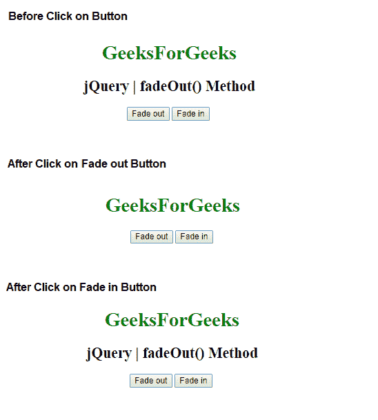
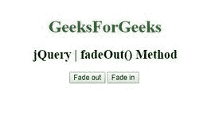
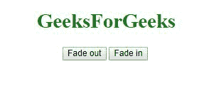
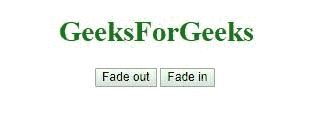

# jQuery |效果 fadeOut()方法

> 原文:[https://www.geeksforgeeks.org/jquery-effect-fadeout-method/](https://www.geeksforgeeks.org/jquery-effect-fadeout-method/)

jQuery 中的**淡出()方法**用于将选定元素的不透明度从可见更改为隐藏。通过使用这种方法，时尚元素将不会占用任何空间。

**语法:**

```
$(selector).fadeOut( speed, easing, callback )
```

**参数:**该方法接受三个参数，如上所述，如下所述:

*   **速度:**为可选参数，用于指定淡入淡出效果的速度。速度的默认值是 400 毫秒。速度的可能值有:
    *   毫秒
    *   “慢”
    *   “快”
*   **缓和:**是可选参数，用于指定元素到动画不同点的速度。宽松的默认值是“摇摆”。宽松政策的可能价值是:
    *   “摇摆”
    *   “线性”
*   **回调:**为可选参数。回调函数在 fadeOut()方法完成后执行。

**示例 1:** 本示例显示 fadeIn 和 fadeOut 效果。

```
<!DOCTYPE html>
<html>

<head> 
    <title>
        jQuery | fadeOut() Method
    </title>

    <script src=
"https://ajax.googleapis.com/ajax/libs/jquery/3.3.1/jquery.min.js">
    </script>
</head> 

<body style = "text-align:center;">  

    <h1 style = "color:green;" >  
        GeeksForGeeks
    </h1>  

    <h2>jQuery | fadeOut() Method</h2>

    <button class="btn1">Fade out</button>

    <button class="btn2">Fade in</button>

    <!-- Script to display fadeIn and fadeOut effect -->
    <script>
        $(document).ready(function(){
            $(".btn1").click(function(){
                $("h2").fadeOut()
            });

            $(".btn2").click(function(){
                $("h2").fadeIn();
            });
        });
    </script>
</body>

</html>  
```

**输出**


**示例 2:** 本示例创建 fadeIn 和 fadeOut 效果并设置其速度。以毫秒为单位的给定速度。

```
<!DOCTYPE html>
<html>

<head> 
    <title>
        jQuery | fadeOut() Method
    </title>

    <script src=
"https://ajax.googleapis.com/ajax/libs/jquery/3.3.1/jquery.min.js">
    </script>
</head> 

<body style = "text-align:center;">  

    <h1 style = "color:green;" >  
        GeeksForGeeks
    </h1>  

    <h2>jQuery | fadeOut() Method</h2>

    <button class="btn1">Fade out</button>

    <button class="btn2">Fade in</button>

    <script>
        $(document).ready(function(){
            $(".btn1").click(function(){
                $("h2").fadeOut(1000);
            });

            $(".btn2").click(function(){
                $("h2").fadeIn(1000);
            });
        });
    </script>
</body>

</html>  
```

**输出:**
**点击淡出按钮后**

**点击淡入按钮后**


**示例 3:** 创建带提醒信息的淡入淡出效果。

```
<!DOCTYPE html>
<html>

<head> 
    <title>
        jQuery | fadeOut() Method
    </title>

    <script src=
"https://ajax.googleapis.com/ajax/libs/jquery/3.3.1/jquery.min.js">
    </script>
</head> 

<body style = "text-align:center;">  

    <h1 style = "color:green;" >  
        GeeksForGeeks
    </h1>  

    <h2>jQuery | fadeOut() Method</h2>

    <button class="btn1">Fade out</button>

    <button class="btn2">Fade in</button>

    <!-- Script to create fadeIn and fadeOut effect -->
    <script>
        $(document).ready(function() {
            $(".btn1").click(function() {
                $("h2").fadeOut(1000, function() {
                    alert("fadeOut() method is finished!");
                });
            });

            $(".btn2").click(function() {
                $("h2").fadeIn(1000, function(){
                    alert("fadeIn() method is finished!");
                });
            });
        });
    </script>
</body>

</html>  
```

**输出:**
**点击淡出按钮后**

**点击淡入按钮后**
