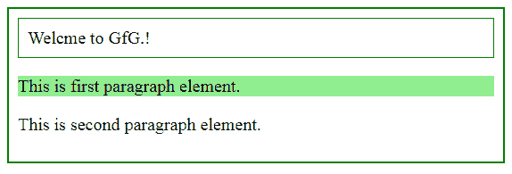
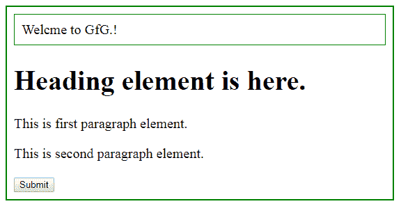

# jQuery |元素+下一个选择器

> 原文:[https://www.geeksforgeeks.org/jquery-element-next-selector/](https://www.geeksforgeeks.org/jquery-element-next-selector/)

**(【元素+下一个】)**选择器在 jQuery 中选择用于选择指定**【元素】**的刚刚**【下一个】**元素。该选择器仅在**“下一个”**元素放置在指定元素之后时有效。

**例如:**

*   如果语句是**$(【div+p】)**，那么这将只选择第一个**“p”**元素，它就在**“div”**旁边，其他**“p”**元素被忽略。
*   但是如果语句是**$(【div+p】)**，并且在所选的**【div】**和**【p】**元素之间放置了一个**【h1】**，那么这个选择器将不起作用，**【p】**元素将保持无效。

**语法:**

```html
$("element + next")
```

**参数:**这里，参数是必需的，这将指定任何有效的元素。

**返回值:**这将返回具有指定更改的选定元素。

**示例-1:** 这里的段落元素就在 div 元素旁边。

## 超文本标记语言

```html
<!DOCTYPE html>
<html>

<head>
    <script src=
"https://ajax.googleapis.com/ajax/libs/jquery/3.3.1/jquery.min.js">
    </script>

    <script>
        $(document).ready(function() {
         $("div + p").css("background-color",
                          "lightgreen");
        });
    </script>

    <style>
        body {
            width: 80%;
            height: 40%;
            padding: 10px;
            border: 2px solid green;
            font-size: 20px;
        }

        div {
            border: 1px solid green;
            padding: 10px;
        }
    </style>
</head>

<body>

    <div>Welcome to GfG.!</div>

<p>This is first paragraph element.</p>

<p>This is second paragraph element.</p>

</body>

</html>
```

**输出:**



**示例-2:** 这里，标题元素位于段落和 div 元素之间。所以“p”元素不会发生变化。

## 超文本标记语言

```html
<!DOCTYPE html>
<html>

<head>
    <script src=
"https://ajax.googleapis.com/ajax/libs/jquery/3.3.1/jquery.min.js">
  </script>

    <script>
        $(document).ready(function() {
            $("button").click(function() {
                $("div + p").css("background-color",
                                 "lightgreen");
            });

        });
    </script>
    <style>
        body {
            width: 80%;
            height: 40%;
            padding: 10px;
            border: 2px solid green;
            font-size: 20px;
        }

        div {
            border: 1px solid green;
            padding: 10px;
        }
    </style>
</head>

<body>

    <div>Welcome to GfG.!</div>
    <h1>Heading element ios here.</h1>

<p>This is first paragraph element.</p>

<p>This is second paragraph element.</p>

    <button>Submit</button>

</body>

</html>
```

**输出:**

**点击前:**



**点击后:**

