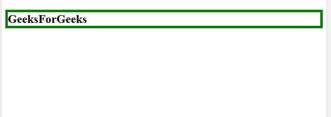

# jQuery |元素选择器

> 原文:[https://www.geeksforgeeks.org/jquery-element-selector/](https://www.geeksforgeeks.org/jquery-element-selector/)

**jQuery 元素选择器**用于根据元素名称选择和修改 HTML 元素。

**语法:**

```html
$("element_name") 

```

**示例-1:** 本示例选择“h2”元素并为其添加边框。

```html
<!DOCTYPE html>
<html>

<head>

    <script src=
"https://ajax.googleapis.com/ajax/libs/jquery/3.3.1/jquery.min.js">
  </script>

  <script>
    $(document).ready(function() {
     $("h2").css("border", 
                 "5px solid green");
        });
    </script>

</head>

<body>

    <h2>GeeksForGeeks
  </h2>

</body>

</html>
```

**输出:**


**示例-2:** 本示例在按钮点击时更改“h2”元素的文本颜色。

```html
<!DOCTYPE html>
<html>

<head>

    <script src=
"https://ajax.googleapis.com/ajax/libs/jquery/3.3.1/jquery.min.js">
  </script>

    <script>
        $(document).ready(function() {
         $("button").click(function() {
            $("h2").css("color",
                   "green");
            });
        });
    </script>

</head>

<body>

    <h2>GeeksForGeeks</h2>

    <button>Change text color
  </button>

</body>

</html>
```

 ****前:**
**

****之后:**
**

****支持的浏览器:****

*   **谷歌 Chrome 90.0+**
*   **Internet Explorer 9.0**
*   **Firefox 3.6**
*   **Safari 4.0**
*   **歌剧 10.5**