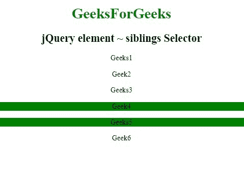

# jQuery |元素~兄弟选择器

> 原文:[https://www . geeksforgeeks . org/jquery-element-姐弟-selector/](https://www.geeksforgeeks.org/jquery-element-siblings-selector/)

jQuery 中的**元素~同级选择器**用于选择指定元素的所有同级元素。

**语法:**

```
("element ~ siblings")
```

**参数:**包含两个参数，如上所述，描述如下:

*   **元素:**为必选项，用于任何有效的 jQuery 选择器。
*   **同辈:**必选参数，用于指定元素参数的同辈。

**示例:**

```
<!DOCTYPE html>
<html>
    <head> 
      <title>
          jQuery element ~ siblings Selector
      </title>
    </head> 

    <body style="text-align:center;">

        <h1 style="color:green;">
            GeeksforGeeks
        </h1>

        <h2>
            jQuery element ~ siblings Selector
        </h2>

        <p>Geeks1</p>

        <div>
            <p>Geek2</p>
            <p>Geeks3</p>
        </div>

        <p>Geek4</p>
        <p>Geeks5</p>

        <div>
            <p>Geek6</p>
        </div>

        <script src=
"https://ajax.googleapis.com/ajax/libs/jquery/3.3.1/jquery.min.js">
        </script>

        <script>
            $(document).ready(function(){
                $("div ~ p").css("background-color", "green");
            });
        </script>
    </body>
</html>
```

**输出:**
