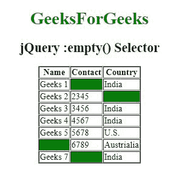
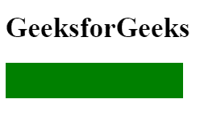

# jQuery |:空选择器

> 原文:[https://www.geeksforgeeks.org/jquery-empty-selector/](https://www.geeksforgeeks.org/jquery-empty-selector/)

jQuery 中的**:空选择器**用于选择空元素。

**语法:**

```
$(":empty")
```

**参数:**空选择器包含单个参数**空**，该参数是必需的，用于选择一个空元素，该元素是没有子元素或文本的元素。

**示例 1:** 本示例使用:空选择器选择表格中的元素位置。

```
<!DOCTYPE html>
<html>

    <head> 
        <title>
            jQuery :empty() Selector
        </title>

        <script src=
"https://ajax.googleapis.com/ajax/libs/jquery/3.3.1/jquery.min.js">
        </script>
    <script>
        $(document).ready(function() {
            $(":empty").css("background-color", "green");
        });
      </script>
    </head> 

    <body>
        <center>  
            <h1 id="geeks1" style = "color:green;">
                GeeksForGeeks
            </h1>

            <h2 id="geeks2">jQuery :empty() Selector</h2>

            <table border="1">
            <tr>
                <th>Name</th>
                <th>Contact</th>
                <th>Country</th>
            </tr>
            <tr>
                <td>Geeks 1</td>
                <td></td>
                <td>India</td>
            </tr>
            <tr>
                <td>Geeks 2</td>
                <td>2345</td>
                <td></td>
            </tr>
            <tr>
                <td>Geeks 3</td>
                <td>3456</td>
                <td>India</td>
            </tr>
            <tr>
                <td>Geeks 4</td>
                <td>4567</td>
                <td>India</td>
            </tr>
            <tr>
                <td>Geeks 5</td>
                <td>5678</td>
                <td>U.S.</td>
            </tr>
            <tr>
                <td></td>
                <td>6789</td>
                <td>Austrialia</td>
            </tr>
            <tr>
                <td>Geeks 7</td>
                <td></td>
                <td>India</td>
            </tr>
            </table>
        </center>
    </body>
</html>  
```

**输出:**


**例 2:** 本例使用:空选择器选择空元素。

```
<!DOCTYPE html>
<html>
    <head> 
      <title>jQuery :empty() Selector</title>

      <script src=
"https://ajax.googleapis.com/ajax/libs/jquery/3.3.1/jquery.min.js">
      </script>

      <!-- Script to use empty selector -->
        <script>
            $(document).ready(function() {
                $("div:empty(.GFG)").css("background-color", "green");
            });
        </script>

        <!-- Style to create box -->
        <style>
            .GFG {
                width:200px;
                height:40px;
            }
        </style>
    </head>

    <body>
        <h1>GeeksforGeeks</h1>
        <div class="GFG"></div>
  </body>
</html>  
```

**输出:**
